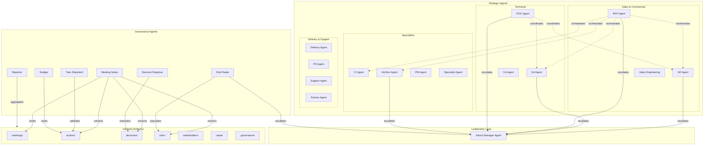
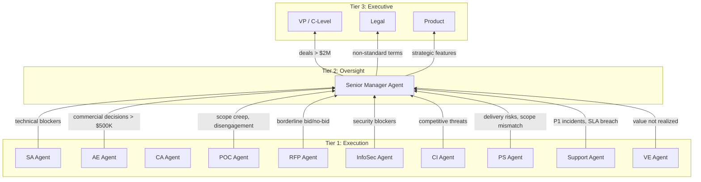
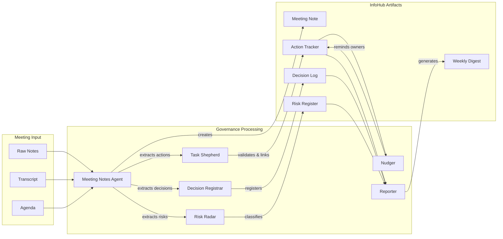
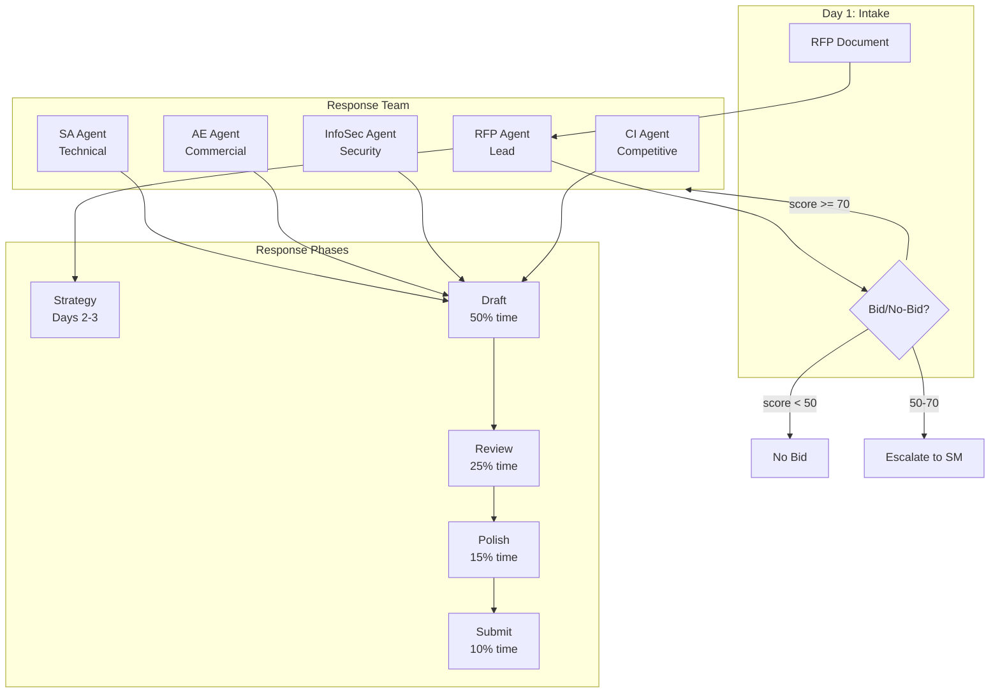
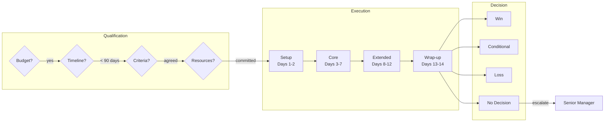

# Agent Architecture

## Overview

The agent system is divided into two categories:
- **Strategic Agents**: Exercise judgment, apply frameworks, make recommendations
- **Governance Agents**: Enforce process, maintain artifacts, reduce entropy

## Agent Landscape

## Escalation Hierarchy

## Governance Agent Flow

## RFP Workflow

## POC Lifecycle

## Agent Summary Table

| Category | Agent | Purpose | Escalates To |
|----------|-------|---------|--------------|
| **Leadership** | Senior Manager | Oversight, coaching, escalation resolution | VP/C-Level |
| **Strategic** | AE Agent | Account strategy, commercial decisions | Senior Manager |
| **Strategic** | SA Agent | Technical architecture, solution design | Senior Manager |
| **Strategic** | CA Agent | Customer architecture tracking | SA Agent |
| **Strategic** | CI Agent | Competitive intelligence | Senior Manager |
| **Strategic** | RFP Agent | RFP response orchestration | Senior Manager |
| **Strategic** | InfoSec Agent | Security/compliance enablement | Senior Manager |
| **Strategic** | POC Agent | Proof of concept execution | Senior Manager |
| **Strategic** | PM Agent | Project coordination | Senior Manager |
| **Strategic** | Delivery Agent | Implementation delivery | PM Agent |
| **Strategic** | Partner Agent | Partner ecosystem | AE Agent |
| **Strategic** | Specialist Agent | Domain expertise | SA Agent |
| **Strategic** | PS Agent | Professional Services pre/post sales | Senior Manager |
| **Strategic** | Support Agent | Support/DSE coordination | Senior Manager |
| **Strategic** | Value Engineering Agent | Business value quantification & tracking | Senior Manager |
| **Governance** | Meeting Notes | Decision-grade meeting artifacts | Nudger |
| **Governance** | Nudger | Follow-up enforcement | Governance Lead |
| **Governance** | Task Shepherd | Action validation | - |
| **Governance** | Decision Registrar | Decision tracking | - |
| **Governance** | Reporter | Weekly digest generation | - |
| **Governance** | Risk Radar | Risk detection and tracking | Senior Manager |
