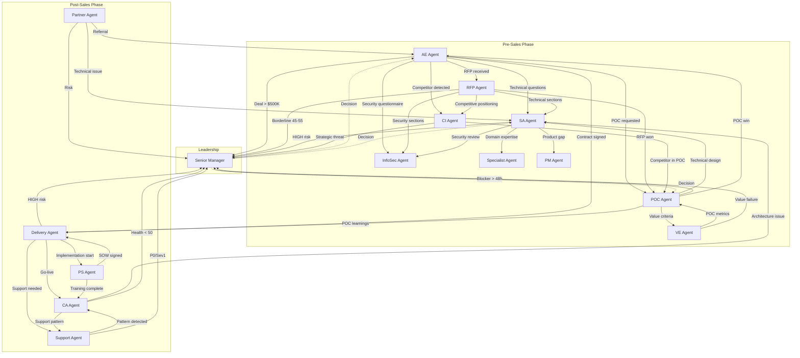
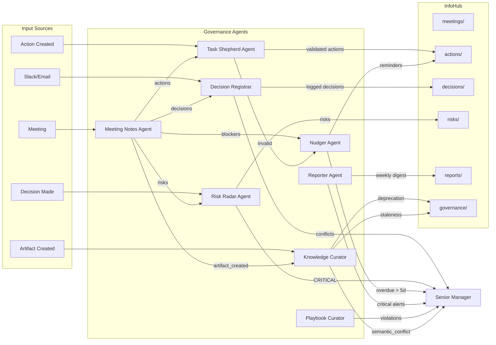
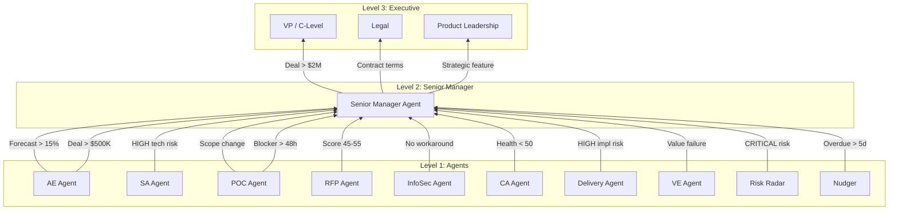
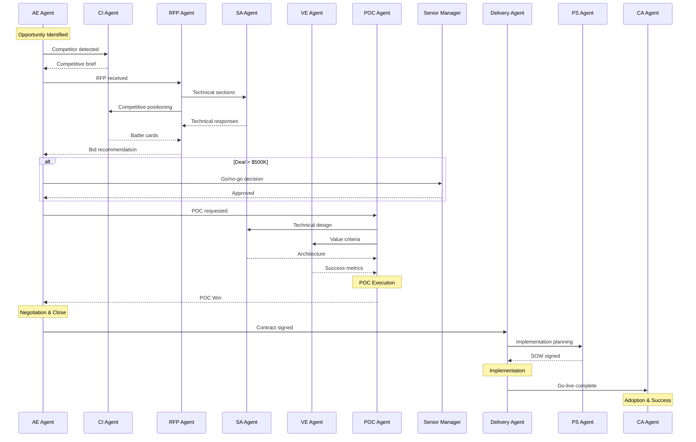
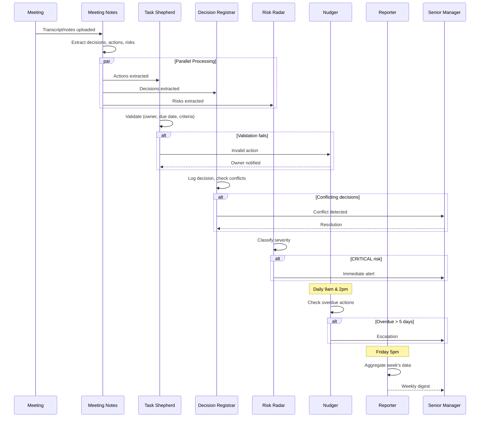
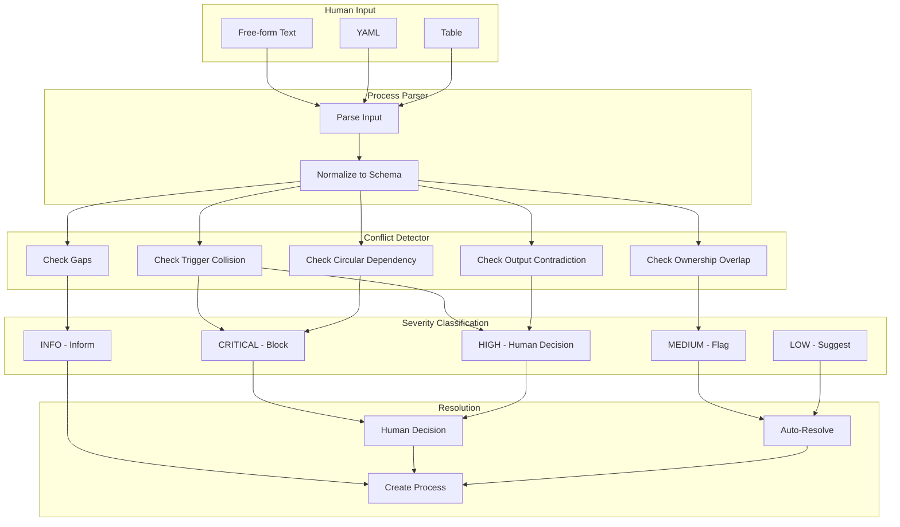

# Agent Handover Diagrams

**Version:** 1.0
**Date:** 2026-01-16

---

## Overview

Visual representation of agent handovers, escalation paths, and information flow.

---

## 1. Strategic Agent Handover Flow

---

## 2. Governance Agent Flow

---

## 3. Escalation Hierarchy

---

## 4. Deal Lifecycle Handover

---

## 5. Governance Processing Pipeline

---

## 6. Conflict Detection Flow (Orchestration)

---

## 7. Quick Reference: Who Handles What

| Scenario | Primary Agent | Handover To | Escalation |
|----------|--------------|-------------|------------|
| New opportunity | AE Agent | - | SM if >$500K |
| RFP received | RFP Agent | SA, InfoSec, CI | SM if score 45-55 |
| POC requested | POC Agent | SA, VE | SM if blocker >48h |
| Technical question | SA Agent | Specialist | SM if HIGH risk |
| Competitor detected | CI Agent | RFP, POC | SM if strategic |
| Security questionnaire | InfoSec Agent | - | SM if blocker |
| Contract signed | Delivery Agent | PS | SM if HIGH risk |
| Implementation | PS Agent | Delivery | SA if technical |
| Go-live | CA Agent | Support | SM if health <50 |
| Support issue | Support Agent | CA, SA | SM if P0/Sev1 |
| Partner engagement | Partner Agent | AE, SA | SM if risk |
| Meeting completed | Meeting Notes | TS, DR, RR | - |
| Action created | Task Shepherd | Nudger | - |
| Decision made | Decision Registrar | RR | SM if conflict |
| Risk identified | Risk Radar | - | SM if CRITICAL |
| Overdue action | Nudger Agent | - | SM if >5 days |
| Artifact created | Knowledge Curator | Owning agent | SM if conflict |
| Semantic conflict | Knowledge Curator | Owning agents | SM if unresolved |
| Stale artifact | Knowledge Curator | Owning agent | - |

---

## 8. SLA Reference

| Priority | Acknowledgment | Escalation After |
|----------|----------------|------------------|
| **Critical** | 1 hour | Immediate to SM |
| **High** | 4 hours | 4 hours to SM |
| **Medium** | 24 hours | 24 hours to Nudger |
| **Low** | 48 hours | 48 hours to Nudger |

| Escalation Level | Trigger | SLA |
|------------------|---------|-----|
| Agent → SM | Defined thresholds | 4h (urgent) / 24h (standard) |
| SM → VP | Deal >$2M | Same day |
| SM → Legal | Contract terms | 24h |
| SM → Product | Strategic feature | 48h |

---

**Note:** These diagrams use Mermaid syntax and can be rendered in any Mermaid-compatible viewer.
