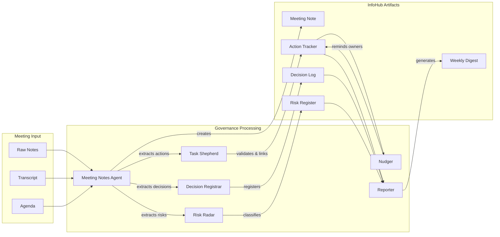
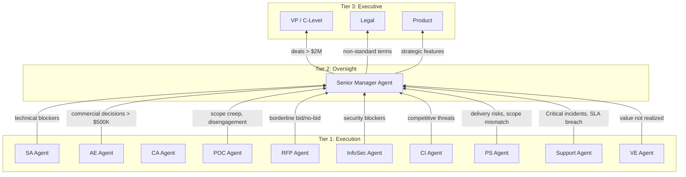
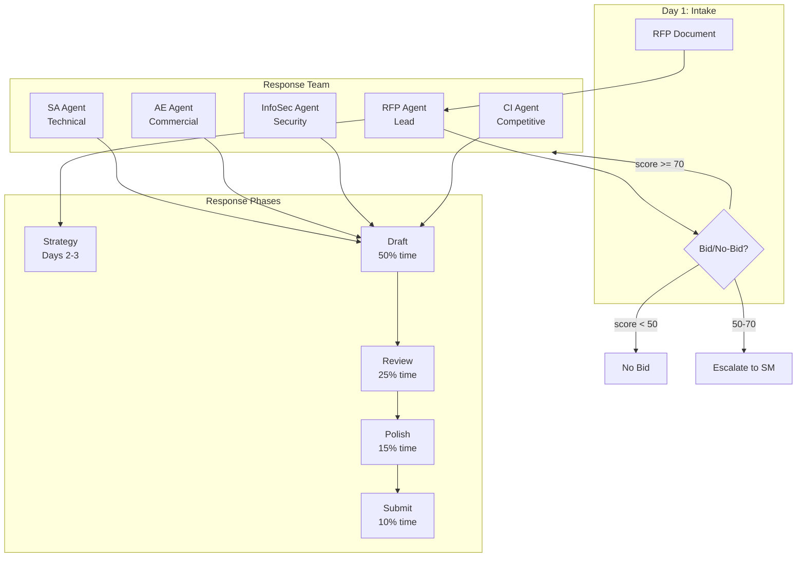
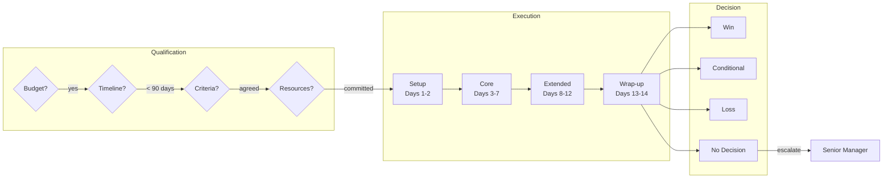

# EA Agentic Lab - Agent Architecture

**Version:** 2.0
**Date:** 2026-01-14
**Status:** Production

## Overview

The EA Agentic Lab implements a multi-agent governance system for strategic account management. Agents are organized into functional categories: **Leadership** (2), **Sales** (4), **Architecture** (3), **Deal Execution** (3), and **Delivery** (3) agents that exercise judgment, plus **Governance Agents** (9) that enforce process.

All agents operate at **Node level** within the Realm/Node hierarchy. See [core-entities.md](../system/core-entities.md) for entity definitions.

---

## Agent Landscape

| Category | Count | Purpose |
|----------|-------|---------|
| Leadership Agents | 2 | Strategic oversight, product alignment |
| Sales Agents | 4 | Commercial strategy, competitive intel, value, partners |
| Architecture Agents | 3 | Solution design, customer architecture, domain expertise |
| Deal Execution Agents | 3 | RFP orchestration, POC validation, security clearance |
| Delivery Agents | 3 | Implementation handoff, services, support |
| Governance Agents | 9 | Enforce process, maintain artifacts, reduce entropy |
| Orchestration Agent | 1 | Meta-layer process management |
| **Total** | **25** | |

```mermaid
flowchart TB
    subgraph Leadership["Leadership"]
        SM[Senior Manager Agent]
        PM[PM Agent]
    end

    subgraph Sales["Sales"]
        AE[AE Agent]
        CI[CI Agent]
        VE[Value Engineering]
        PT[Partner Agent]
    end

    subgraph Architecture["Architecture"]
        SA[SA Agent]
        CA[CA Agent]
        SP[Specialist Agent]
    end

    subgraph DealExec["Deal Execution"]
        RFP[RFP Agent]
        POC[POC Agent]
        IS[InfoSec Agent]
    end

    subgraph Delivery["Delivery"]
        DL[Delivery Agent]
        PS[PS Agent]
        SUP[Support Agent]
    end

    subgraph Governance["Governance Agents"]
        direction LR
        MN[Meeting Notes]
        NU[Nudger]
        TS[Task Shepherd]
        DR[Decision Registrar]
        RP[Reporter]
        RR[Risk Radar]
    end

    subgraph InfoHub["InfoHub (Artifacts)"]
        direction LR
        MT[meetings/]
        AC[actions/]
        DC[decisions/]
        RS[risks/]
        SK[stakeholders/]
        VL[value/]
        GV[governance/]
    end

    %% Escalation flows to Senior Manager
    AE -->|escalates| SM
    SA -->|escalates| SM
    RFP -->|escalates| SM
    POC -->|escalates| SM
    IS -->|escalates| SM
    RR -->|escalates| SM

    %% Strategic collaboration
    RFP -.->|orchestrates| SA
    RFP -.->|orchestrates| AE
    RFP -.->|orchestrates| CI
    RFP -.->|orchestrates| IS
    POC -.->|coordinates| SA
    POC -.->|coordinates| AE

    %% Governance writes to InfoHub
    MN -->|writes| MT
    MN -->|extracts| AC
    MN -->|extracts| DC
    MN -->|extracts| RS
    TS -->|validates| AC
    DR -->|maintains| DC
    RR -->|populates| RS
    NU -->|reads| AC
    RP -->|aggregates| InfoHub
```



---

## Leadership Agents (2)

Provide strategic oversight, resolve escalations, and ensure product roadmap alignment.

| Agent | Team | Purpose | Status |
|-------|------|---------|--------|
| Senior Manager Agent | leadership | Oversight, coaching, escalation resolution | Configured |
| PM Agent | product_managers | Product roadmap alignment | Configured |

## Sales Agents (4)

Drive commercial strategy, competitive positioning, value quantification, and partner alignment.

| Agent | Team | Purpose | Status |
|-------|------|---------|--------|
| AE Agent | account_executives | Account strategy, commercial decisions | Configured |
| CI Agent | competitive_intelligence | Competitive intelligence | Configured |
| VE Agent | value_engineering | Business value quantification | Configured |
| Partner Agent | partners | Partner ecosystem coordination | Configured |

## Architecture Agents (3)

Maintain technical integrity through solution design, customer architecture tracking, and domain expertise routing.

| Agent | Team | Purpose | Status |
|-------|------|---------|--------|
| SA Agent | solution_architects | Technical architecture, solution design | Implemented |
| CA Agent | customer_architects | Customer architecture tracking | Configured |
| Specialist Agent | specialists | Domain expertise | Configured |

## Deal Execution Agents (3)

Handle structured processes that convert opportunities into wins.

| Agent | Team | Purpose | Status |
|-------|------|---------|--------|
| RFP Agent | rfp | RFP response orchestration | Configured |
| POC Agent | poc | Proof of concept execution | Configured |
| InfoSec Agent | infosec | Security/compliance enablement | Configured |

## Delivery Agents (3)

Bridge what was sold with what gets implemented.

| Agent | Team | Purpose | Status |
|-------|------|---------|--------|
| Delivery Agent | delivery | Implementation delivery | Configured |
| PS Agent | professional_services | Professional Services pre/post sales | Configured |
| Support Agent | support | Support/DSE coordination | Configured |

---

## Governance Agents (9)

Enforce process, maintain artifacts, reduce entropy.

| Agent | Purpose | Trigger |
|-------|---------|---------|
| Meeting Notes Agent | Extract decisions/actions/risks from meetings | meeting_notes_available |
| Nudger Agent | Reminder and escalation enforcement | Schedule + events |
| Task Shepherd Agent | Action validation and linkage | action_created |
| Decision Registrar Agent | Decision lifecycle tracking | decision_mentioned |
| Reporter Agent | Weekly digest generation | Schedule (Friday 5pm) |
| Risk Radar Agent | Risk detection and classification | Events + schedule |
| Playbook Curator Agent | Playbook validation, structure governance | on_change |
| InfoHub Curator Agent | Semantic integrity, artifact lifecycle (Vaults 1 & 2) | artifact_created/updated |
| Knowledge Vault Curator Agent | Knowledge item governance, proposal validation (Vault 3) | knowledge_proposal/updated |

### Governance Agent Flow

From meeting input through artifact creation, governance agents form a processing pipeline that extracts structured data from unstructured meeting content.



---

## Escalation Hierarchy

Escalation follows a three-tier model. Execution agents escalate to the Senior Manager based on domain-specific thresholds, and the Senior Manager routes to executive stakeholders when decisions exceed their authority.



---

## RFP Workflow



---

## POC Lifecycle



---

## Agent Communication

Agents communicate via the **InfoHub** at Node level. There is no direct agent-to-agent messaging; the InfoHub serves as the single source of truth, with all operations scoped to a single Node.

```text
┌─────────────────────────────────────────────────────────────────────┐
│                        AGENT COMMUNICATION                           │
├─────────────────────────────────────────────────────────────────────┤
│                                                                      │
│   Functional Agents ─────► InfoHub ◄────── Governance Agents        │
│                              │                                       │
│                              ▼                                       │
│                    {realm}/{node}/                                  │
│                    ├── external-infohub/                             │
│                    │   ├── architecture/                             │
│                    │   ├── decisions/                                │
│                    │   └── value/                                    │
│                    ├── internal-infohub/                             │
│                    │   ├── risks/                                    │
│                    │   ├── actions/                                  │
│                    │   ├── frameworks/                               │
│                    │   └── governance/                               │
│                    └── meetings/                                     │
│                                                                      │
└─────────────────────────────────────────────────────────────────────┘
```

---

## Directory Structure

```text
ea-agentic-lab/
├── teams/                                   # Agent definitions (24 agents)
│   ├── governance/                          # 8 governance agents
│   │   └── agents/
│   │       ├── meeting_notes_agent.yaml
│   │       ├── nudger_agent.yaml
│   │       ├── task_shepherd_agent.yaml
│   │       ├── decision_registrar_agent.yaml
│   │       ├── reporter_agent.yaml
│   │       ├── risk_radar_agent.yaml
│   │       └── playbook_curator_agent.yaml
│   │
│   ├── solution_architects/                 # Strategic agents
│   │   └── agents/sa_agent.yaml
│   ├── account_executives/
│   │   └── agents/ae_agent.yaml
│   ├── customer_architects/
│   │   └── agents/ca_agent.yaml
│   ├── competitive_intelligence/
│   │   └── agents/ci_agent.yaml
│   ├── value_engineering/
│   │   └── agents/ve_agent.yaml
│   ├── leadership/
│   │   └── agents/senior_manager_agent.yaml
│   └── [... other strategic teams]
│
├── core/
│   ├── playbook_engine/                     # Playbook execution
│   ├── workflows/                           # Governance orchestrator
│   └── tools/                               # Utilities
│
├── playbooks/
│   ├── executable/                          # Strategic playbooks (production)
│   ├── operational/                         # Operational playbooks
│   └── validation/                          # Strategic playbooks (testing)
│
└── examples/
    └── {realm}/{node}/                      # Test data (Realm/Node structure)
```

---

## Playbook Categories

| Category | Prefix | Purpose | Execution |
|----------|--------|---------|-----------|
| Strategic | PB_xxx | Framework operationalization, holistic synthesis | End-to-end, human review |
| Operational | OP_xxx | Event-driven tactical procedures | Triggered, automated |

Both categories execute at **Node level only**.

---

## Key Design Principles

1. **Node-Centric** - All operations scoped to single Node
2. **Modularity** - Each agent is independent
3. **Configurability** - Behavior defined in YAML
4. **InfoHub-Centric** - Shared knowledge base per Node
5. **Human-in-the-Loop** - Escalations, not full autonomy
6. **Separation of Concerns** - Functional agents (Leadership, Sales, Architecture, Deal Execution, Delivery) vs Governance agents
7. **Single Decision Authority** - Each decision type has one authoritative playbook

---

## Detailed Agent Reference

| Category | Agent | Purpose | Escalates To |
|----------|-------|---------|--------------|
| **Leadership** | Senior Manager | Oversight, coaching, escalation resolution | VP/C-Level |
| **Leadership** | PM Agent | Product roadmap alignment | Senior Manager |
| **Sales** | AE Agent | Account strategy, commercial decisions | Senior Manager |
| **Sales** | CI Agent | Competitive intelligence | Senior Manager |
| **Sales** | VE Agent | Business value quantification & tracking | Senior Manager |
| **Sales** | Partner Agent | Partner ecosystem | Senior Manager |
| **Architecture** | SA Agent | Technical architecture, solution design | Senior Manager |
| **Architecture** | CA Agent | Customer architecture tracking | Senior Manager |
| **Architecture** | Specialist Agent | Domain expertise | SA Agent |
| **Deal Execution** | RFP Agent | RFP response orchestration | Senior Manager |
| **Deal Execution** | POC Agent | Proof of concept execution | Senior Manager |
| **Deal Execution** | InfoSec Agent | Security/compliance enablement | Senior Manager |
| **Delivery** | Delivery Agent | Implementation delivery | Senior Manager |
| **Delivery** | PS Agent | Professional Services pre/post sales | Senior Manager |
| **Delivery** | Support Agent | Support/DSE coordination | Senior Manager |
| **Governance** | Meeting Notes | Decision-grade meeting artifacts | Nudger |
| **Governance** | Nudger | Follow-up enforcement | Governance Lead |
| **Governance** | Task Shepherd | Action validation | - |
| **Governance** | Decision Registrar | Decision tracking | - |
| **Governance** | Reporter | Weekly digest generation | - |
| **Governance** | Risk Radar | Risk detection and tracking | Senior Manager |

---

## Related Documentation

- [Core Entities](../system/core-entities.md) - Blueprint, Realm, Node definitions
- [Playbook Specification](../playbooks/playbook-execution-specification.md) - Strategic playbooks
- [Operational Playbook Spec](../playbooks/operational-playbook-spec.md) - Tactical playbooks

---

*Last Updated: 2026-01-14*
