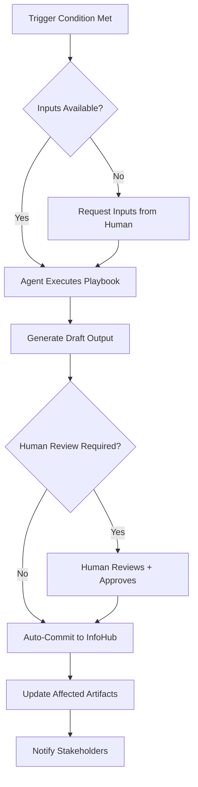

# Playbook Framework - Consulting Frameworks as Executable Intelligence

**Purpose:** Operationalize proven consulting frameworks as lightweight, agent-executable playbooks

**Inspiration:** Security analytics playbooks (SOAR) - event-driven, rule-based, automated

---

## Playbook Design Principles

### What is a Playbook?

A **playbook** is a lightweight, structured procedure that:
- **Triggers** on specific conditions
- **Executes** a proven framework/methodology
- **Produces** actionable insights or artifacts
- **Requires** minimal human input (but allows human-in-the-loop)

### Playbook vs. Framework vs. Process

| Type | Complexity | Automation | Use Case |
|------|------------|------------|----------|
| **Framework** | High - conceptual model | Manual | Strategic thinking (3 Horizons) |
| **Process** | Medium - step-by-step | Semi-automated | Repeatable workflows (RFP) |
| **Playbook** | Low - executable rules | Automated | Triggered responses (Risk detected → Run SWOT) |

### Lightweight Playbook Structure

```yaml
playbook_id: "PB_001_three_horizons"
name: "McKinsey Three Horizons Growth Analysis"
framework_source: "McKinsey & Company"
category: "strategic_planning"

trigger:
  conditions:
    - "Account planning requested"
    - "New client onboarded"
    - "Annual strategy review"
  agent: "AE Agent or SA Agent"

inputs_required:
  - client_id
  - current_installed_base (ARR, products)
  - known_opportunities
  - customer_strategic_initiatives

procedure:
  steps:
    - id: 1
      action: "Analyze current revenue (Horizon 1)"
      agent_task: "Extract installed base, current ARR, active use cases"

    - id: 2
      action: "Identify expansion opportunities (Horizon 2)"
      agent_task: "Match customer initiatives to platform capabilities"

    - id: 3
      action: "Envision future possibilities (Horizon 3)"
      agent_task: "Identify emerging tech trends, potential disruptions"

    - id: 4
      action: "Generate Three Horizons visualization"
      output_format: "markdown table + narrative"

outputs:
  - artifact: "three_horizons_analysis.md"
    location: "InfoHub/strategy/"
  - update: "Account Plan - 3 Horizons section"

decision_criteria:
  - "Horizon 1 ARR >= $X → Focus on retention"
  - "Horizon 2 pipeline < $Y → Trigger expansion plays"
  - "Horizon 3 empty → Schedule innovation workshop"

human_review_required: true
estimated_execution_time: "5 minutes (agent) + 10 minutes (human review)"
```

---

## Framework-to-Agent Mapping

[image: Framework-Agent Matrix - heatmap showing which agents own or contribute to which frameworks]

### Strategic Planning Frameworks → AE Agent

| Framework | Source | When to Apply | Agent Output |
|-----------|--------|---------------|--------------|
| **Three Horizons** | McKinsey | Account planning, QBRs | Revenue roadmap across time horizons |
| **Growth-Share Matrix** | BCG | Portfolio analysis | Product prioritization (Stars, Cash Cows, Dogs) |
| **Ansoff Matrix** | Igor Ansoff | Growth strategy | Market penetration vs. diversification |
| **Value Pyramid** | Bain | Value proposition | Customer value hierarchy |

### Technical Architecture Frameworks → SA Agent

| Framework | Source | When to Apply | Agent Output |
|-----------|--------|---------------|--------------|
| **Porter's Five Forces** | Michael Porter | Competitive positioning | Competitive dynamics analysis |
| **Technology Adoption Curve** | Geoffrey Moore | Solution maturity assessment | Adoption stage + strategy |
| **TOGAF ADM** | The Open Group | Architecture planning | Architecture decision records |
| **12-Factor App** | Heroku | Cloud-native assessment | Deployment readiness checklist |

### Value Engineering Frameworks → All Agents

| Framework | Source | When to Apply | Agent Output |
|-----------|--------|---------------|--------------|
| **Value Engineering** | SAVE International | Business case development | ROI analysis, value narrative |
| **Cost-Benefit Analysis** | Economics | Investment decisions | NPV, payback period |
| **Business Model Canvas** | Strategyzer | Solution design | Canvas with 9 building blocks |

### Risk Management Frameworks → SA + Delivery Agents

| Framework | Source | When to Apply | Agent Output |
|-----------|--------|---------------|--------------|
| **SWOT Analysis** | Albert Humphrey | Strategic assessment | Strengths, Weaknesses, Opportunities, Threats |
| **Risk Matrix (5x5)** | ISO 31000 | Risk assessment | Risk severity + likelihood grid |
| **FMEA** | Automotive | Failure mode analysis | Criticality ranking |
| **Pre-Mortem** | Gary Klein | Project risk planning | Failure scenarios + mitigations |

### Customer Success Frameworks → CA Agent

| Framework | Source | When to Apply | Agent Output |
|-----------|--------|---------------|--------------|
| **Customer Health Score** | Gainsight | Retention monitoring | Health metrics + churn risk |
| **Net Promoter System** | Bain | Loyalty measurement | NPS score + detractor analysis |
| **Adoption Maturity Model** | Custom | Solution adoption | Maturity stage + next steps |

### Competitive Analysis Frameworks → CI Agent

| Framework | Source | When to Apply | Agent Output |
|-----------|--------|---------------|--------------|
| **Competitive Positioning Map** | Strategy | Market positioning | 2x2 positioning matrix |
| **Win/Loss Analysis** | Sales Ops | Deal retrospectives | Win factors + loss reasons |
| **Battlecard Framework** | Product Marketing | Competitive response | Head-to-head comparison |

---

## Playbook Execution Model

### Trigger Types

1. **Event-Driven Triggers**
   ```yaml
   trigger:
     event: "new_risk_detected"
     severity: "HIGH"
     execute: "PB_SWOT_risk_analysis"
   ```

2. **Scheduled Triggers**
   ```yaml
   trigger:
     schedule: "monthly"
     day: 1
     execute: "PB_account_health_review"
   ```

3. **Condition-Based Triggers**
   ```yaml
   trigger:
     condition: "ARR_growth < 10% YoY"
     execute: "PB_growth_strategy_matrix"
   ```

4. **Human-Initiated Triggers**
   ```yaml
   trigger:
     command: "/run playbook PB_three_horizons"
     context: "current_client"
   ```

### Execution Flow



---

## Example Playbooks

### PB_001: McKinsey Three Horizons Analysis

**File:** `playbooks/executable/PB_001_three_horizons.yaml`

```yaml
playbook_id: "PB_001"
name: "Three Horizons Growth Analysis"
framework: "McKinsey Three Horizons of Growth"
source_url: "https://www.mckinsey.com/capabilities/strategy-and-corporate-finance/our-insights/enduring-ideas-the-three-horizons-of-growth"

description: |
  Analyzes account growth across three time horizons:
  - H1: Defend and extend core business (0-12 months)
  - H2: Nurture emerging opportunities (1-3 years)
  - H3: Create transformational options (3-5 years)

trigger:
  manual: true
  conditions:
    - "Account planning cycle"
    - "Strategic review requested"
    - "New executive sponsor engagement"

inputs:
  required:
    - client_id
    - current_arr
    - installed_products
    - customer_strategic_initiatives
  optional:
    - competitor_intel
    - market_trends

agent_procedure:
  horizon_1:
    prompt: |
      Analyze current platform usage and identify:
      - Core use cases generating revenue today
      - Renewal risks
      - Upsell opportunities within existing deployment
      - Product optimization potential

    extract_from:
      - "InfoHub/clients/{client_id}/installed_base.md"
      - "Daily notes mentioning {client_id}"
      - "Support cases, usage metrics"

    output_schema:
      - use_case
      - arr_contribution
      - health_status
      - upsell_potential
      - risk_level

  horizon_2:
    prompt: |
      Identify emerging opportunities (1-3 years):
      - Customer IT initiatives aligned with platform capabilities
      - Adjacent use cases (have Search, could add Observability)
      - Platform consolidation opportunities
      - New business units/regions

    extract_from:
      - "InfoHub/clients/{client_id}/it_initiatives.md"
      - "Account plan - customer vision section"
      - "PM Agent feature requests"

    output_schema:
      - opportunity
      - platform_capability
      - estimated_arr
      - timeline
      - dependencies

  horizon_3:
    prompt: |
      Envision transformational possibilities (3-5 years):
      - Industry trends affecting customer
      - Emerging technologies (GenAI, Edge, IoT)
      - Business model shifts
      - Disruptive scenarios where platform becomes strategic

    extract_from:
      - "Customer public statements, earnings calls"
      - "Industry research"
      - "Platform product roadmap"

    output_schema:
      - trend
      - platform_opportunity
      - potential_arr_range
      - risk_probability

synthesis:
  action: "Generate Three Horizons visualization and narrative"
  template: "templates/three_horizons_output.md"

outputs:
  primary:
    file: "InfoHub/strategy/{client_id}_three_horizons.md"
    format: "markdown with embedded table and narrative"

  updates:
    - "Account Plan: Update '3 Horizons' section"
    - "Executive Brief: Add growth roadmap summary"

decision_points:
  - condition: "H1 ARR > 80% of total pipeline"
    recommendation: "Focus on H2 expansion to diversify"

  - condition: "H2 pipeline < $500K"
    recommendation: "Schedule account planning workshop"

  - condition: "H3 section empty"
    recommendation: "Engage PM for roadmap alignment discussion"

success_metrics:
  - "Account plan updated with growth roadmap"
  - "H2 opportunities identified and quantified"
  - "H3 vision aligned with product strategy"

estimated_time:
  agent_execution: "3-5 minutes"
  human_review: "10-15 minutes"

frequency: "Quarterly or on-demand"
owner_agent: "AE Agent (primary), SA Agent (technical input)"
```

---

### PB_002: SWOT Analysis (Risk Context)

**File:** `playbooks/risk/PB_002_swot_risk.yaml`

```yaml
playbook_id: "PB_002"
name: "SWOT Analysis for Risk Context"
framework: "SWOT Analysis"

trigger:
  conditions:
    - "High-severity risk detected"
    - "Client with 3+ open medium risks"
    - "Quarterly account review"

inputs:
  required:
    - client_id
    - trigger_risk_id (if triggered by risk)

agent_procedure:
  strengths:
    prompt: "What advantages do we have with this client? (relationship, technical fit, revenue, champions)"
    sources: ["Account plan", "Relationship map", "Win notes"]

  weaknesses:
    prompt: "What vulnerabilities exist? (gaps, technical debt, competitor presence)"
    sources: ["Risk register", "Support escalations", "Competitive intel"]

  opportunities:
    prompt: "What growth potential exists? (expansion, new use cases, partnerships)"
    sources: ["H2/H3 analysis", "Customer initiatives", "PM feature requests"]

  threats:
    prompt: "What external factors could harm the relationship? (budget cuts, competitor moves, org changes)"
    sources: ["Market intel", "News", "Stakeholder changes"]

outputs:
  file: "InfoHub/strategy/{client_id}_swot_{date}.md"
  updates:
    - "Risk mitigation plan informed by SWOT"
    - "Account strategy adjusted based on threats"

estimated_time: "2 minutes"
```

---

### PB_003: Porter's Five Forces (Competitive Analysis)

**File:** `playbooks/competitive/PB_003_five_forces.yaml`

```yaml
playbook_id: "PB_003"
name: "Porter's Five Forces - Competitive Dynamics"
framework: "Michael Porter's Five Forces"

trigger:
  conditions:
    - "Competitive evaluation phase (Stage 2-3)"
    - "Competitive intel agent flags competitor mention"
    - "RFP/POC initiated"

agent_procedure:
  force_1_competitive_rivalry:
    prompt: "Who are direct competitors in this deal? What's their positioning?"

  force_2_supplier_power:
    prompt: "What's customer's dependency on vendors? Switching costs?"

  force_3_buyer_power:
    prompt: "Customer's bargaining position? Price sensitivity?"

  force_4_threat_of_substitutes:
    prompt: "What alternative solutions exist? (DIY, open source, adjacent products)"

  force_5_new_entrants:
    prompt: "Emerging competitors? Market barriers?"

outputs:
  file: "InfoHub/competitive/{client_id}_five_forces.md"
  battlecard_update: true

estimated_time: "4 minutes"
```

---

## Playbook Library Structure

```
ea-agentic-lab/
└── playbooks/
    ├── README.md                      # Playbook catalog
    ├── strategic/
    │   ├── PB_001_three_horizons.yaml
    │   ├── PB_002_ansoff_matrix.yaml
    │   ├── PB_003_bcg_matrix.yaml
    │   └── PB_004_value_pyramid.yaml
    │
    ├── technical/
    │   ├── PB_101_five_forces.yaml
    │   ├── PB_102_adoption_curve.yaml
    │   ├── PB_103_12factor_check.yaml
    │   └── PB_104_adr_generation.yaml
    │
    ├── risk/
    │   ├── PB_201_swot_analysis.yaml
    │   ├── PB_202_risk_matrix.yaml
    │   ├── PB_203_premortem.yaml
    │   └── PB_204_fmea.yaml
    │
    ├── value/
    │   ├── PB_301_value_engineering.yaml
    │   ├── PB_302_roi_analysis.yaml
    │   ├── PB_303_business_model_canvas.yaml
    │   └── PB_304_cost_benefit.yaml
    │
    ├── customer_success/
    │   ├── PB_401_health_score.yaml
    │   ├── PB_402_adoption_maturity.yaml
    │   └── PB_403_nps_analysis.yaml
    │
    └── competitive/
        ├── PB_501_positioning_map.yaml
        ├── PB_502_win_loss_analysis.yaml
        └── PB_503_battlecard_gen.yaml
```

---

## Playbook Execution Engine

### Core Components

```python
# core/playbook_engine.py

class PlaybookEngine:
    """Execute consulting framework playbooks"""

    def __init__(self):
        self.playbook_registry = self.load_playbooks()

    def load_playbooks(self) -> Dict[str, Playbook]:
        """Load all playbooks from playbooks/ directory"""
        pass

    def check_triggers(self, event: Event) -> List[Playbook]:
        """Check which playbooks should trigger for given event"""
        pass

    def execute_playbook(self, playbook_id: str, inputs: Dict) -> PlaybookResult:
        """Execute a specific playbook"""
        pass

    def generate_output(self, result: PlaybookResult, template: str) -> str:
        """Format playbook results using template"""
        pass
```

---

## Integration with Agent Architecture

### Agent Updates

Each agent gets playbook capabilities:

```yaml
# teams/account_executives/agents/ae_agent.yaml

agent_id: "ae_agent"
team: "account_executives"

playbooks_owned:
  - "PB_001_three_horizons"
  - "PB_002_ansoff_matrix"
  - "PB_301_value_engineering"

playbooks_contribute_to:
  - "PB_201_swot_analysis"  # Provides commercial context
  - "PB_401_health_score"   # Provides relationship data
```

---

## Benefits of Framework-as-Playbook Approach

1. **Leverage Proven Methodologies**
   - No need to invent, use McKinsey/BCG best practices
   - Instant credibility with customers and management

2. **Repeatable & Scalable**
   - Same playbook runs consistently across all accounts
   - Junior team members get senior-level frameworks automatically

3. **Automated Intelligence**
   - Agents apply frameworks continuously
   - Humans review, approve, refine

4. **Knowledge Codification**
   - Tribal knowledge → executable playbooks
   - Framework expertise embedded in system

5. **Measurable Execution**
   - Track playbook usage, success rates
   - Improve playbooks based on outcomes

---

## Next Steps

1. **Create playbook catalog** (20-30 key frameworks)
2. **Build playbook engine** (`core/playbook_engine.py`)
3. **Design output templates** for each framework
4. **Test with 3-5 playbooks** on real data
5. **Expand library** based on usage

---

**Status:** Framework designed, ready for implementation
