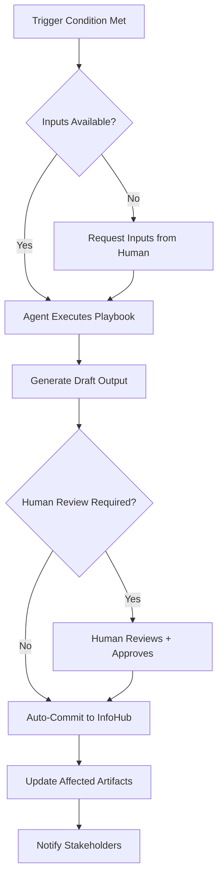

# Playbook System

A playbook is the mechanism by which the agent system operationalizes consulting frameworks and responds to events with repeatable, auditable procedures. This document is the single authoritative reference for how playbooks are defined, typed, executed, authored, and validated. All content from the original fragmented docs (`playbook-framework.md`, `playbook-architecture-fix.md`, `operational-playbook-spec.md`, `playbook-creation-guide.md`) is consolidated here.

---

## 1. What a Playbook Is

A **playbook** is a structured, agent-executable procedure that applies a methodology or responds to a signal to produce a defined output. The inspiration comes from security SOAR playbooks: event-driven, rule-based, automated, and auditable by design.

Playbooks sit at a specific layer in the domain model:

```
Prompt  →  Tool
         ↓
       Skill           (what an agent can do, reusable)
         ↓
      Runbook          (how to handle a scenario, sequences skills)
         ↓
      Playbook         (cross-role procedure applying a framework or responding to an event)
         ↓
      Blueprint        (org-level orchestration)
```

**Skill vs. Runbook vs. Playbook:** A Skill is reusable across many contexts. A Runbook is scenario-specific and sequences skills within one agent. A Playbook coordinates across agents, applies an external framework, and produces outputs that become InfoHub artifacts or gap reports. Playbooks are not generated once and forgotten; they run continuously or on trigger, always against current InfoHub data.

Every playbook has exactly one **owner agent** (accountable for execution and output quality) and zero or more **contributing agents** (provide data or context). The owner-contributor separation is defined in `domain/mappings/agent_role_mapping.yaml`.

---

## 2. Types of Playbooks

The system distinguishes two major types with fundamentally different purposes. Mixing their characteristics in a single playbook is a governance violation (CAT-002). Understanding the distinction before authoring is critical because it determines the schema, the allowed output destinations, and the runtime behavior.

### 2.1 Strategic Assessment Playbooks

Strategic playbooks apply holistic consulting frameworks to assess account or project state. They serve humans first: the value comes from end-to-end synthesis, not from individual steps.

**Characteristics:**
- Require holistic synthesis across multiple InfoHub sources
- Updateable when customer or internal context changes
- Blueprint-like: each execution covers the full framework, not a slice
- Owner agent orchestrates, contributing agents provide domain data

**Naming convention:** `PB_[DOMAIN]_[NUMBER]_[framework_name].yaml`

**Prefix:** `PB_`

**Modes within strategic playbooks:**

| Mode | Purpose | Output |
|------|---------|--------|
| **GENERATIVE** | Produce new analysis artifacts from raw data | Markdown files, decision objects, InfoHub updates |
| **VALIDATION** | Check whether framework elements exist and are current | Gap reports, severity warnings, recommended actions |

The validation mode is preferred for continuous monitoring. A generative playbook runs once to produce an artifact; a validation playbook runs on a schedule or on data change to detect drift.

**Current strategic playbooks:**

| ID | Framework | Mode | Owner |
|----|-----------|------|-------|
| PB_STR_001 | Three Horizons of Growth (McKinsey) | Generative → needs refactor to Validation | AE Agent |
| PB_STR_002 | Ansoff Growth Matrix | Validation | AE Agent |
| PB_STR_003 | BCG Growth-Share Matrix | Validation | AE Agent |
| PB_STR_004 | SWOT Analysis | Generative → needs refactor | SA Agent |
| PB_SA_001 | TOGAF ADM | Generative → needs refactor | SA Agent |
| PB_VE_001 | Value Engineering | Generative → needs refactor | AE Agent |
| PB_CA_007 | Customer Health Score | Generative → needs refactor | CA Agent |
| PB_CI_001 | Porter's Five Forces | Generative → needs refactor | CI Agent |

**Allowed write destinations (strategic):**
- `{realm}/{node}/internal-infohub/frameworks/`
- `{realm}/{node}/internal-infohub/governance/health_score.yaml`
- `{realm}/{node}/external-infohub/value/`
- `{realm}/{node}/external-infohub/architecture/`

### 2.2 Operational Playbooks

Operational playbooks are event-driven tactical procedures. They react to signals, thresholds, or events and produce discrete artifacts or actions. They do not synthesize; they read pre-computed data and act on it.

**Characteristics:**
- Triggered by events, signals, thresholds, schedules, or manual commands
- Can run partially or repeatedly without losing coherence
- Produce a single clear artifact, action, notification, or decision record
- Steps are atomic: each step succeeds or fails independently
- Outputs are deterministic: same inputs produce same outputs

**Naming convention:** `OP_[CATEGORY]_[NUMBER]_[action].yaml`

**Prefix:** `OP_`

**Category codes:**

| Code | Domain |
|------|--------|
| `RSK` | Risk management |
| `ACT` | Action management |
| `DEC` | Decision management |
| `MTG` | Meeting processing |
| `REP` | Reporting |
| `ESC` | Escalation |
| `VAL` | Value tracking |
| `HLT` | Health monitoring |

**Current operational playbooks:**
- OP_RSK_001: Register New Risk
- OP_ACT_001: Create Action Item
- OP_ESC_001: Escalate Blocked Action
- OP_MTG_001: Process Meeting Notes
- OP_HLT_001: Health Score Alert

**Allowed write destinations (operational only):**
- `{realm}/{node}/internal-infohub/actions/`
- `{realm}/{node}/internal-infohub/risks/`
- `{realm}/{node}/meetings/`
- `{realm}/{node}/external-infohub/decisions/`
- `{realm}/{node}/internal-infohub/governance/alerts/`
- `notification_queue`

### 2.3 Governance Rules

The Playbook Curator Agent validates all playbooks against these rules before registration.

**CAT-001: No Micro-Playbook Decomposition.** Strategic playbooks must remain holistic. Do not split SWOT into four separate playbooks.

**CAT-002: No Governance-Tactical Mixing.** Each step must be either governance (analysis or judgment) or tactical (automation), not both. An operational playbook that includes an `analyze` step followed by a `write` step violates this rule.

**CAT-003: No Cross-Type Destination Writes.** Operational playbooks must not write to strategic artifact destinations. Strategic playbooks must not write to operational destinations.

**CAT-004: Single Decision Authority.** Each decision type has exactly one authoritative playbook. Other playbooks pass raw signals; they do not classify or decide.

| Decision Type | Authority | Other Playbooks |
|---------------|-----------|-----------------|
| Risk severity | OP_RSK_001 | Pass raw signals only |
| Action priority | OP_ACT_001 | Pass raw requests only |
| Escalation target | OP_ESC_001 | Trigger only |
| Health score | PB_CA_007 | Read-only |

### 2.4 Relationship Between Types

Strategic and operational playbooks are linked: a strategic playbook may trigger one or more operational playbooks when it detects a condition that requires a discrete action.

```
Strategic Assessment Playbook
         │
         │ may trigger (event/threshold)
         ▼
Operational Playbook(s)
         │
         │ produces
         ▼
    InfoHub Artifacts
```

**Example flow:**
1. PB_STR_004 (SWOT) identifies a critical threat
2. Triggers OP_RSK_001 (Register New Risk)
3. OP_RSK_001 creates a risk entry in `risk_register.yaml`
4. A threshold breach on the risk register triggers OP_ESC_001
5. OP_ESC_001 notifies the Senior Manager Agent

---

## 3. How Playbooks Execute

### 3.1 Runtime Model

The execution model distinguishes how a playbook is activated from how it runs internally. A playbook always runs in the context of an owner agent; the agent is responsible for routing inputs, evaluating conditions, and committing outputs.

**Trigger types and their schemas:**

```yaml
# Event trigger
trigger:
  type: "event"
  source: "meeting_notes_agent"
  condition: "EVENT_TYPE == 'new_risk_identified'"

# Signal trigger
trigger:
  type: "signal"
  source: "risk_radar_agent"
  condition: "$.signals.competitive_threat.strength > 0.7"

# Threshold trigger
trigger:
  type: "threshold"
  source: "health_score"
  condition: "$.governance.health_score.overall < 60"

# Scheduled trigger
trigger:
  type: "scheduled"
  source: "cron"
  condition: "schedule == 'weekly_monday'"

# Manual trigger
trigger:
  type: "manual"
  source: "user"
  condition: "MANUAL_TRIGGER == true"
  # Also accepts: /run playbook PB_three_horizons
```

**Execution flow:**



### 3.2 Decision Logic Language (DLL)

All playbook conditions are written in the **Decision Logic Language**: JSONPath queries combined with Python comparison operators, evaluated against InfoHub data. Pseudo-code conditions that look executable but are not (`horizon_1_risks[severity=HIGH].count > 0`) are not permitted.

**Operators:**

```yaml
<, >, <=, >=, ==, !=    # Comparison
AND, OR, NOT            # Logical
IN, NOT IN              # Membership
EXISTS, NOT EXISTS      # Presence check
```

**Standard condition patterns:**

```yaml
# EXISTS check
condition: "$.horizon_2.opportunities EXISTS"

# COUNT check
condition: "$.risks[?(@.severity=='HIGH')].length >= 2"

# THRESHOLD check (referencing config, not hard-coded)
condition: "$.horizon_1.arr_percentage > ${thresholds.horizon_1_concentration_max}"
threshold_ref: "playbook_thresholds.PB_STR_001_three_horizons.horizon_1_concentration_max"

# CONTAINS check
condition: "'qdrant' IN $.competitive.competitors[*].name.lower()"

# MISSING check
condition: "$.swot.strengths.count == 0"
```

Hard-coded numeric thresholds (`ARR > $500K`, `ROI >= 300%`) inside playbook YAML are not permitted. All thresholds live in `domain/config/playbook_thresholds.yaml` and are referenced by key.

### 3.3 Trust Tiers

Each playbook declares a trust tier that controls whether its outputs require human sign-off before being committed to InfoHub.

| Tier | Label | Behavior |
|------|-------|----------|
| 1 | **autonomous** | Output committed automatically; human notified but not blocked |
| 2 | **review** | Output staged as draft; human must approve before commit |
| 3 | **human-decides** | Playbook produces options and analysis; human makes the final call |

The trust tier is declared in the playbook's metadata block:

```yaml
metadata:
  trust_tier: "review"  # autonomous | review | human-decides
```

Operational playbooks typically run at `autonomous`. Strategic generative playbooks typically run at `review`. Strategic playbooks that produce decisions with business-significant consequences should run at `human-decides`.

### 3.4 Step Actions (Operational Playbooks)

Operational playbook steps use a constrained set of action types to keep steps atomic and auditable.

```yaml
# Read
action: "read"
inputs:
  - name: "source"
    source: "$.infohub.risks.risk_register"

# Analyze (governance steps only)
action: "analyze"
inputs:
  - name: "data"
    source: "$.context.meeting_notes"
  - name: "criteria"
    source: "$.playbook.analysis_criteria"

# Write
action: "write"
inputs:
  - name: "content"
    source: "$.steps.step_1.output"
  - name: "destination"
    source: "$.infohub.risks.risk_register"

# Notify
action: "notify"
inputs:
  - name: "recipient"
    source: "$.stakeholders.risk_owner"
  - name: "message"
    source: "$.templates.risk_notification"

# Escalate
action: "escalate"
inputs:
  - name: "target"
    source: "senior_manager_agent"
  - name: "context"
    source: "$.escalation.context"
```

### 3.5 Failure Handling

Every step must declare its `on_failure` behavior. Silent failures are never permitted. All failure responses must be actionable: they must tell the agent or human what went wrong, why, and what to do next.

**Failure modes:**

- **skip**: Continue to next step, emit `SIG_PLAYBOOK_STEP_SKIPPED`, notify agent with missing-data description and suggestions for continuing
- **stop**: Halt execution, emit `PRECONDITION_FAILED`, provide error code, reason, what was required, what was found, what is missing, and next steps
- **escalate**: Route to a target agent or human with full context, step description, available data summary, and recommended actions; can continue or stop after escalation
- **retry**: Retry with exponential backoff (default: 3 attempts, 1s initial delay, 2x multiplier), escalate on final failure

```yaml
# Stop example
on_failure:
  action: "stop"
  error_response:
    error_code: "PRECONDITION_FAILED"
    message: "Cannot proceed - required data missing"
    reason: "{specific_missing_requirement}"
    suggestions:
      - "Verify the node has been properly initialized"
      - "Check if required artifacts exist using 'get_node_context'"
      - "Create missing artifacts before re-running this playbook"
    context:
      required: "{what_was_required}"
      available: "{what_was_found}"
      missing: "{what_is_missing}"
```

### 3.6 Evidence Citations

Every output object in a playbook must include an `evidence` array. Outputs without evidence are rejected by the EvidenceValidator. This applies to SWOT items, Three Horizons opportunities, decision records, and all other output types.

```yaml
evidence:
  - source_artifact: "InfoHub/stakeholders/c4/relationship_map.md"
    date: "2025-12-15"
    excerpt: "Monthly technical sync with CTO Andreas"
    confidence: "HIGH"   # HIGH | MEDIUM | LOW
```

---

## 4. How to Create a Playbook

### 4.1 Choose the Right Type First

Before writing YAML, answer these questions to select the correct type and mode.

The following characteristics determine the type and mode:

- Triggered by a business event or data condition, produces a single artifact or action, and does not synthesize across multiple frameworks: **operational playbook**
- Applies a named consulting or analytical framework end-to-end and produces a holistic assessment: **strategic assessment playbook**
- Among strategic playbooks: new artifact from raw data on demand → **GENERATIVE mode**; continuous check of existing InfoHub state for completeness → **VALIDATION mode**

Validation mode is preferred. Generative mode is only needed when no InfoHub artifact for the framework yet exists.

### 4.2 Strategic Playbook Schema

The following blocks are mandatory in every strategic playbook.

```yaml
# REQUIRED BLOCKS (all strategic playbooks)
framework_name: string
framework_source: string
playbook_mode: "VALIDATION" | "GENERATIVE"
intended_agent_role: string
primary_objective: string

# For VALIDATION playbooks
validation_frequency: string          # "Monthly + on account plan update"
validation_criteria: object           # What to check for existence/completeness
gap_detection: array                  # Warnings with severity + action
validation_inputs: object             # Where to read data from
validation_outputs: object            # Gap reports, not generated artifacts
validation_checks: object

# For GENERATIVE playbooks
trigger_conditions: object
decision_logic: array                 # All conditions in DLL syntax
agent_procedure: object               # Prompts per framework dimension
outputs: object                       # Artifacts to write to InfoHub

# Always required
framework_reference: object           # Human-readable reference
last_updated: "YYYY-MM-DD"
version: "X.Y"
status: string                        # "draft" | "production_ready"

# OPTIONAL BLOCKS (only if framework requires)
calculation_formulas: object          # Only if quantitative
adr_conventions: object               # Only for ADR playbooks
health_score_calculation: object      # Only for health score playbooks
```

**Field name conventions:** Use plural for lists (`calculation_formulas`, not `calculation_formula`). Optional blocks must not appear if the framework does not use them.

### 4.3 Validation Playbook Example (Three Horizons)

```yaml
framework_name: "Three Horizons of Growth"
playbook_mode: "VALIDATION"
intended_agent_role: "AE Agent"
primary_objective: "Validate growth strategy completeness across H1, H2, and H3"
validation_frequency: "Monthly + on account plan update"

validation_criteria:
  horizon_1_checks:
    - exists: "Current ARR documented"
    - exists: "Active use cases identified"
    - exists: "Renewal risks assessed"
    - threshold: "H1 ARR < 80% of total (healthy portfolio balance)"

  horizon_2_checks:
    - exists: "Expansion opportunities documented"
    - exists: "Pipeline value quantified"
    - threshold: "H2 pipeline >= ${thresholds.PB_STR_001.horizon_2_pipeline_min}"

  horizon_3_checks:
    - exists: "Future vision documented"
    - exists: "Strategic initiatives aligned with roadmap"

gap_detection:
  - if_missing: "H2 opportunities"
    severity: "HIGH"
    warning: "Account has no documented growth path beyond current deployment"
    action: "AE should conduct expansion discovery workshop"

  - if_threshold_violated: "$.horizon_1.arr_percentage > ${thresholds.PB_STR_001.horizon_1_concentration_max}"
    severity: "MEDIUM"
    warning: "Revenue concentration risk - account over-reliant on current business"
    action: "Focus on H2 expansion to diversify"

  - if_missing: "H3 vision"
    severity: "CRITICAL"
    warning: "No transformational vision documented"
    action: "Conduct H3 visioning workshop with customer"

validation_inputs:
  primary: "InfoHub/clients/{client_id}/account_plan.md"
  secondary:
    - "InfoHub/clients/{client_id}/installed_base.md"
    - "InfoHub/clients/{client_id}/it_initiatives.md"

validation_outputs:
  type: "Gap Report"
  format: "List of missing elements + severity + recommended actions"

framework_reference:
  source: "McKinsey & Company"
  url: "https://www.mckinsey.com/capabilities/strategy-and-corporate-finance/our-insights/enduring-ideas-the-three-horizons-of-growth"
  summary: "H1: defend/extend (0-12m), H2: nurture emerging (1-3y), H3: create transformational options (3-5y)"

last_updated: "2026-01-14"
version: "2.0"
status: "production_ready"
```

### 4.4 Operational Playbook Schema

```yaml
playbook_id: "OP_XXX"
version: "1.0"
category: "operational"

metadata:
  name: "Human-readable name"
  description: "What this playbook does"
  owner_agent: "agent_id"
  participating_agents: []
  trust_tier: "autonomous"    # autonomous | review | human-decides

trigger:
  type: "event|signal|threshold|scheduled|manual"
  source: "Where the trigger originates"
  condition: "DLL condition"

preconditions:
  - condition: "DLL expression"
    error_message: "What to show if not met"

steps:
  - step_id: "step_1"
    name: "Step name"
    agent: "responsible_agent_id"
    action: "read|analyze|write|notify|escalate"
    inputs:
      - name: "input_name"
        source: "jsonpath or literal"
    outputs:
      - name: "output_name"
        type: "artifact|decision|action|notification"
        destination: "infohub path or channel"
        evidence: []    # REQUIRED
    on_failure: "skip|stop|escalate|retry"

outputs:
  - output_id: "out_1"
    type: "artifact|decision|action|notification"
    format: "yaml|markdown|json"
    destination: "infohub path or channel"

escalation:
  condition: "When to escalate"
  target: "agent or human"
  message_template: "What to communicate"

completion:
  success_criteria: "DLL expression"
  artifacts_required: []
  notification: "Who to notify on completion"
```

### 4.5 Authoring Steps

These are the steps to follow when creating a new playbook. Do not start with YAML before completing the first three.

1. **Identify the trigger.** What event, signal, threshold, or schedule activates this playbook? Be specific.
2. **Classify the type.** Apply the questions in section 4.1. Confirm the type with the Playbook Curator Agent before writing schema.
3. **Define the owner agent.** Check `domain/mappings/agent_role_mapping.yaml` to confirm ownership. One owner, always.
4. **Map inputs to InfoHub paths.** Every input must have a concrete JSONPath or InfoHub path. No vague sources.
5. **Write conditions in DLL.** No pseudo-code. Test all JSONPath expressions against sample InfoHub data.
6. **Extract thresholds to config.** Any numeric value that could change goes into `domain/config/playbook_thresholds.yaml`, referenced by key.
7. **Require evidence on outputs.** Every output object must declare an `evidence: []` field. Fill it; do not leave it empty.
8. **Validate against governance rules.** Run through CAT-001 through CAT-004 before submitting.
9. **Set the trust tier.** Default to `review` for strategic playbooks, `autonomous` for operational playbooks unless a human decision is required.

### 4.6 Validation Checklist

Before a playbook is registered in the system, it must pass all of the following checks.

```
Schema
  [ ] playbook_mode declared (VALIDATION | GENERATIVE)
  [ ] intended_agent_role matches agent in agent_role_mapping.yaml
  [ ] last_updated and version present
  [ ] status set to "draft" or "production_ready"

Conditions
  [ ] All conditions use DLL syntax (JSONPath + operator + value)
  [ ] No hard-coded thresholds in playbook YAML
  [ ] All threshold_ref keys exist in playbook_thresholds.yaml

Outputs
  [ ] All output objects have evidence: [] field
  [ ] Write destinations match allowed list for playbook type
  [ ] No operational playbook writes to strategic destinations

Governance
  [ ] CAT-001: Strategic playbooks not decomposed into micro-playbooks
  [ ] CAT-002: No governance/tactical step mixing in same playbook
  [ ] CAT-003: Destinations match type (strategic or operational)
  [ ] CAT-004: No unauthorized decision authority

Trust
  [ ] trust_tier declared
  [ ] human_review_required consistent with trust_tier

Agent Routing
  [ ] Owner agent declared and valid
  [ ] Contributing agents listed if applicable
```

### 4.7 Framework-to-Agent Mapping

The following table shows which agent owns playbooks for each consulting domain. Contribute to a playbook by providing domain data; do not duplicate ownership.

**AE Agent (account strategy, commercial):**
Three Horizons, Ansoff Matrix, BCG Matrix, Porter's Generic Strategies, Value Proposition Canvas, Elements of Value Pyramid, Power Curve, Blue Ocean Strategy, Value Engineering

**SA Agent (technical architecture, risk):**
SWOT Analysis, PESTLE Analysis, Decision Tree Analysis, Risk Heat Map, McKinsey 7S Framework, Pace-Layered Application Strategy, Cost-Benefit Analysis, TOGAF ADM

**CI Agent (competitive intelligence):**
Porter's Five Forces, Competitive Positioning Map, Win/Loss Analysis

**CA Agent / Delivery Agent (customer success, transformation governance):**
Customer Health Score, Kotter's 8-Step Change Model, Three Lines of Defense, Operating Model Canvas, OKR Framework, Transformation Office Model, Adoption Maturity Model

**Exec Sponsor / Stakeholder coordination (maps to AE + governance functions):**
Stakeholder Mapping, Influence Model, RACI Matrix, McKinsey 5 Frames of Performance, Results Delivery Framework

---

## 5. Canvas Integration

Canvases are a rendering layer on top of playbook outputs. A canvas is not itself a playbook; it is a structured one-page visual artifact that renders InfoHub data into a human-consumable snapshot. The canvas framework is documented in full in [canvas-framework.md](./canvas-framework.md). This section covers only the integration points.

### 5.1 How Canvases Connect to Playbooks

Two administrative playbooks manage the canvas lifecycle. They are the only playbooks permitted to write to the canvas destinations.

**PB_ADM_001: Render Canvas.** Loads a canvas spec from the registry, gathers data from the source InfoHub paths declared in the spec, validates content against the spec's validation rules, and outputs both a Markdown file (for agents and version control) and an HTML file (for human stakeholders). This playbook is triggered by data changes, scheduled refreshes, or manual request.

**PB_ADM_002: Canvas Gap Analysis.** Checks canvas coverage across all nodes in a realm. It detects missing required canvases, incomplete canvases that fail validation, stale canvases that have not been refreshed within their declared cadence, and orphan canvases whose source data no longer exists.

### 5.2 Automatic Re-Render Triggers

Canvases are always current because they are rendered from live InfoHub data, not maintained manually. The trigger linkage between playbook execution and canvas re-render is declared in the canvas spec's `triggers` block.

| InfoHub Event | Canvases That Re-Render |
|---------------|------------------------|
| SWOT analysis updated | Context Canvas, Value & Stakeholders Canvas |
| New risk identified | Risk & Governance Canvas |
| New decision extracted from meeting | Decision Canvas |
| Architecture decision recorded | Architecture Decision Canvas |

### 5.3 Canvas Output Destinations

Canvas assets are stored at `{realm}/{node}/external-infohub/canvas/`. Each node maintains a `canvas/index.yaml` that tracks canvas type, context ID, last rendered timestamp, validation status, and source artifact references. The index is updated automatically by PB_ADM_001 after each render.

### 5.4 Canvas Lifecycle States

A canvas moves through defined states. Playbooks that trigger canvas renders transition state from the output side; the canvas system manages state on the input side.

| State | Meaning |
|-------|---------|
| Draft | Created but incomplete (validation warnings present) |
| Review | Complete, pending human approval |
| Published | Approved for stakeholder sharing |
| Stale | Not refreshed within the declared cadence |
| Archived | Superseded or no longer relevant |

---

## 6. Playbook Library

The full library of playbooks lives in `ea-agentic-lab/playbooks/`. The directory structure separates strategic assessment playbooks by domain and operational playbooks by category.

```
playbooks/
├── README.md                     # Playbook catalog and index
├── strategic/
│   ├── PB_STR_001_three_horizons.yaml
│   ├── PB_STR_002_ansoff_matrix.yaml
│   ├── PB_STR_003_bcg_matrix.yaml
│   └── ...
├── technical/
│   ├── PB_SA_001_togaf_adm.yaml
│   └── ...
├── risk/
│   ├── PB_STR_004_swot_analysis.yaml
│   └── ...
├── value/
│   ├── PB_VE_001_value_engineering.yaml
│   └── ...
├── customer_success/
│   ├── PB_CA_007_customer_health_score.yaml
│   └── ...
├── competitive/
│   ├── PB_CI_001_five_forces.yaml
│   └── ...
├── validation/
│   ├── PB_STR_002_ansoff_matrix.yaml
│   ├── PB_STR_003_bcg_matrix.yaml
│   └── ...
├── operational/
│   ├── OP_RSK_001_register_new_risk.yaml
│   ├── OP_ACT_001_create_action_item.yaml
│   ├── OP_MTG_001_process_meeting_notes.yaml
│   ├── OP_ESC_001_escalate_blocked_action.yaml
│   └── ...
└── canvas/
    ├── registry.yaml
    ├── specs/
    └── templates/
```

---

## 7. Implementation Status

The playbook system has its specification fully defined. The execution engine has not yet been implemented.

**Completed:**
- Execution specification (DLL, threshold management, evidence validation, agent role mapping)
- Threshold configuration file (`domain/config/playbook_thresholds.yaml`)
- Agent role mapping (`domain/mappings/agent_role_mapping.yaml`)
- 2 of 25 validation playbooks created (PB_STR_002, PB_STR_003)
- Canvas framework spec and templates

**Remaining:**
- Phase 1: Implement `core/playbook_engine/` (DecisionEvaluator, ThresholdManager, EvidenceValidator, PlaybookRouter, PlaybookExecutor)
- Phase 2: Refactor 6 existing generative playbooks to validation mode and DLL-compliant conditions
- Phase 3: Create remaining 22 validation playbooks using the standard schema
- Phase 4: Create all remaining operational playbooks

**Recommended sequence:** Phase 2 (refactor existing) before Phase 3 (create new) so all playbooks follow the standard before the engine is built against them.

---

## Related Documentation

- [Canvas Framework](./canvas-framework.md) - Visual artifact rendering from InfoHub data
- [Domain Model](../system/domain-model.md) - Where playbooks fit in the full domain hierarchy
- [Output Contract](../system/output-contract.md) - Artifact output standards
- [Vault Architecture](../system/vault-architecture.md) - InfoHub data storage model
- [Tool Design Principles](../system/tool-design-principles.md) - Principles governing actionable error handling
