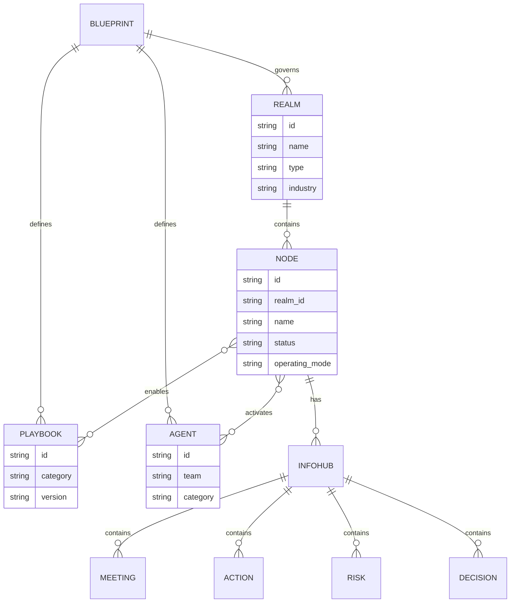

# Core Entities

**Version:** 1.0
**Date:** 2026-01-14
**Status:** Canonical Reference

---

## Entity Hierarchy

[image: Realm-Node Hierarchy - how blueprints contain realms containing nodes with InfoHub sections]

```
┌─────────────────────────────────────────────────────────────────────┐
│                           BLUEPRINT                                  │
│                    (Governance Model)                                │
│         How governance works across all Realms and Nodes            │
├─────────────────────────────────────────────────────────────────────┤
│                                                                      │
│  ┌─────────────────────────────────────────────────────────────┐    │
│  │                         REALM                                │    │
│  │                      (Company)                               │    │
│  │                                                              │    │
│  │   ┌─────────────┐  ┌─────────────┐  ┌─────────────┐         │    │
│  │   │    NODE     │  │    NODE     │  │    NODE     │         │    │
│  │   │ (Initiative)│  │ (Initiative)│  │ (Initiative)│         │    │
│  │   │             │  │             │  │             │         │    │
│  │   │ • Playbooks │  │ • Playbooks │  │ • Playbooks │         │    │
│  │   │ • InfoHub   │  │ • InfoHub   │  │ • InfoHub   │         │    │
│  │   │ • Agents    │  │ • Agents    │  │ • Agents    │         │    │
│  │   └─────────────┘  └─────────────┘  └─────────────┘         │    │
│  │                                                              │    │
│  └─────────────────────────────────────────────────────────────┘    │
│                                                                      │
└─────────────────────────────────────────────────────────────────────┘
```

---

## Entity Definitions

### Blueprint

**Definition:** The governance model that defines HOW governance works.

**Scope:** Global - applies across all Realms and Nodes.

**Contains:**
- Agent architecture (strategic + governance agents)
- Playbook categories and governance rules
- Escalation hierarchies
- Decision authority matrices
- Operating cadence standards

**Example:** The EA Agentic Lab governance model itself is a Blueprint.

**NOT a Blueprint:**
- Individual playbooks (those are part of the Blueprint)
- Customer-specific configurations (those are Realm/Node settings)

---

### Realm

**Definition:** A company or organization that contains multiple autonomous Nodes.

**Scope:** Organization-level container.

**Contains:**
- Multiple Nodes (initiatives, projects, programs)
- Realm-level configuration (defaults, policies)
- Cross-Node governance (shared stakeholders, dependencies)

**Examples:**

| Realm | Description |
|-------|-------------|
| ACME | Manufacturing conglomerate customer |
| GlobalTech | Energy sector customer |
| FinCorp | Financial services customer |
| Internal Platform | Internal company initiatives |

**Properties:**
```yaml
realm:
  id: "realm_bmw"
  name: "ACME"
  type: "customer"  # customer | partner | internal
  industry: "manufacturing"
  region: "EMEA"
  tier: "strategic"  # strategic | enterprise | commercial
  nodes: []  # List of Node IDs
  realm_config:
    default_thresholds: {}
    shared_stakeholders: []
    governance_overrides: {}
```

---

### Node

**Definition:** An autonomous unit of work within a Realm. Previously called "account".

**Scope:** Initiative, project, or program level.

**Contains:**
- InfoHub (all artifacts for this Node)
- Enabled playbooks (subset of Blueprint playbooks)
- Active agents (configured for this Node)
- Node-specific thresholds and rules

**Examples:**

| Realm | Node | Description |
|-------|------|-------------|
| ACME | Security Platform Consolidation | Replace 12 security tools with unified platform |
| ACME | Observability Rollout BU-X | Deploy observability to Business Unit X |
| ACME | Cloud Migration Initiative | Migrate on-prem workloads to cloud |
| GlobalTech | SIEM Modernization | Replace legacy SIEM with modern solution |
| Internal Platform | Developer Portal | Internal developer experience platform |

**Properties:**
```yaml
node:
  id: "node_bmw_security_consolidation"
  realm_id: "realm_bmw"
  name: "Security Platform Consolidation"
  purpose: "Replace 12 security tools with unified platform"
  status: "active"  # planning | active | on_hold | completed | cancelled

  # Lifecycle
  created: "2026-01-01"
  target_completion: "2026-12-31"

  # Operating mode
  operating_mode: "pre_sales"  # pre_sales | implementation | post_sales | renewal

  # Enabled playbooks (from Blueprint)
  enabled_playbooks:
    strategic:
      - "PB_001"  # Three Horizons
      - "PB_201"  # SWOT
      - "PB_301"  # Value Engineering
    operational:
      - "OP_RSK_001"
      - "OP_ACT_001"
      - "OP_MTG_001"

  # Node-specific configuration
  node_config:
    thresholds:
      minimum_arr: 500000
      health_score_warning: 60
    stakeholders: []
    agents_enabled: []

  # Relationships
  relationships:
    depends_on: []  # Other Node IDs
    related_to: []  # Other Node IDs
    parent_node: null  # For sub-initiatives
```

---

### Playbook

**Definition:** Executable instructions that operationalize a framework or respond to events.

**Scope:** Node-level execution.

**Categories:**

| Category | Purpose | Example |
|----------|---------|---------|
| **Strategic** | Framework operationalization, holistic synthesis | PB_201 SWOT Analysis |
| **Operational** | Event-driven tactical procedures | OP_RSK_001 Register Risk |

**Relationship to Blueprint:**
- Playbooks are DEFINED in the Blueprint
- Playbooks are ENABLED per Node
- Not all playbooks are active for every Node

---

## Entity Relationships



---

## InfoHub Structure (Per Node)

```
{realm}/{node}/
├── node_profile.yaml                    # Node configuration and status
├── external-infohub/                    # Customer-shareable artifacts
│   ├── architecture/                    # ADRs (TOGAF format)
│   ├── context/                         # Discovery, requirements
│   ├── decisions/                       # Architecture decisions
│   ├── value/value_tracker.yaml         # Value delivered
│   ├── journey/                         # POC, adoption milestones
│   └── opportunities/                   # Expansion opportunities
├── internal-infohub/                    # Vendor-only artifacts
│   ├── risks/risk_register.yaml
│   ├── stakeholders/                    # Key contact profiles
│   ├── competitive/                     # Competitive intelligence
│   ├── governance/
│   │   ├── operating_cadence.yaml
│   │   ├── health_score.yaml
│   │   └── alerts/                      # Operational alerts
│   ├── frameworks/                      # Strategic playbook outputs
│   ├── actions/action_tracker.yaml
│   └── agent_work/                      # Agent scratchpads
├── meetings/
│   ├── external/                        # Customer meetings
│   └── internal/                        # Deal reviews, syncs
└── decisions/decision_log.yaml          # Decision log
```

---

## Terminology Migration

### Before → After

| Old Term | New Term | Context |
|----------|----------|---------|
| account | node | Unit of work, initiative |
| client_id | node_id | Identifier |
| account_profile | node_profile | Configuration file |
| infohub/{account}/ | {realm}/{node}/external-infohub/ or {realm}/{node}/internal-infohub/ | File path |

### Code Impact

Files requiring update:
- `config/playbook_thresholds.yaml` - threshold references
- `core/playbook_engine/*.py` - variable names
- `playbooks/operational/*.yaml` - path references
- `examples/` - folder structure
- `tests/*.py` - test fixtures

---

## Examples

### Example 1: ACME Security Initiative

```yaml
realm:
  id: "realm_bmw"
  name: "ACME"
  type: "customer"
  industry: "manufacturing"
  tier: "strategic"

node:
  id: "node_bmw_security_consolidation"
  realm_id: "realm_bmw"
  name: "Security Platform Consolidation"
  purpose: "Replace 12 security tools with unified platform"
  status: "active"
  operating_mode: "pre_sales"
  enabled_playbooks:
    strategic: ["PB_001", "PB_201", "PB_301", "PB_401", "PB_701"]
    operational: ["OP_RSK_001", "OP_ACT_001", "OP_ESC_001", "OP_MTG_001"]
```

### Example 2: Internal Platform Initiative

```yaml
realm:
  id: "realm_internal"
  name: "Internal Platform"
  type: "internal"
  industry: "technology"
  tier: "internal"

node:
  id: "node_internal_devportal"
  realm_id: "realm_internal"
  name: "Developer Portal"
  purpose: "Unified developer experience platform"
  status: "active"
  operating_mode: "implementation"
  enabled_playbooks:
    strategic: ["PB_101", "PB_201"]  # TOGAF + SWOT only
    operational: ["OP_ACT_001", "OP_MTG_001"]
```

---

## Validation Rules

### Realm Validation

- Realm ID must be unique
- Realm must have at least one Node
- Realm type must be: customer | partner | internal

### Node Validation

- Node ID must be unique within Realm
- Node must reference valid Realm
- Enabled playbooks must exist in Blueprint
- Operating mode must be valid

### Playbook-Node Relationship

- Strategic playbooks require full Node context
- Operational playbooks require Node + trigger event
- Node can disable playbooks but not modify them

---

## Execution Scoping Rules

### Critical: Node-Level Execution

**All playbooks (strategic and operational) execute at Node level:**

```text
┌─────────────────────────────────────────────────────────────────────┐
│                           EXECUTION SCOPE                            │
├─────────────────────────────────────────────────────────────────────┤
│                                                                      │
│  Playbook Execution:                                                 │
│  ┌─────────────────────────────────────────────────────────────┐    │
│  │                    ALWAYS at NODE level                      │    │
│  │                                                              │    │
│  │  • Reads artifacts from: {realm}/{node}/*           │    │
│  │  • Writes artifacts to:  {realm}/{node}/*           │    │
│  │  • Context scope:        Single Node only                    │    │
│  │  • Never reasons at:     Realm level or Account level       │    │
│  └─────────────────────────────────────────────────────────────┘    │
│                                                                      │
│  Realm Level (Aggregation Only):                                    │
│  ┌─────────────────────────────────────────────────────────────┐    │
│  │  • Roll-up views across Nodes                               │    │
│  │  • Governance dashboards                                     │    │
│  │  • Cross-Node dependencies                                   │    │
│  │  • NOT for playbook execution                               │    │
│  └─────────────────────────────────────────────────────────────┘    │
│                                                                      │
└─────────────────────────────────────────────────────────────────────┘
```

### Node-Centric Operations

| Operation | Scope | Example |
|-----------|-------|---------|
| Run PB_201 SWOT | Node | SWOT for "Security Consolidation" node |
| Register Risk | Node | Risk in ACME/SECURITY_CONSOLIDATION/internal-infohub/risks/ |
| Process Meeting | Node | Meeting notes for specific initiative |
| Health Score | Node | Health of single node, not realm |
| Action Tracking | Node | Actions within single initiative |

### Realm-Level Views (Read-Only Aggregation)

| View | Purpose | NOT Used For |
|------|---------|--------------|
| Realm Dashboard | Roll-up across all nodes | Playbook execution |
| Cross-Node Risks | Identify patterns | Writing artifacts |
| Governance Summary | Leadership reporting | Agent reasoning |

### Why Node-Level Matters

1. **Isolation:** Each Node has independent governance lifecycle
2. **Clarity:** No ambiguity about which initiative owns an artifact
3. **Scalability:** Nodes can be added/removed without affecting others
4. **Accountability:** Single owner per Node, clear responsibility

---

## Node Page Presentation Contract

The node detail page is the primary workspace for a single engagement. It organizes content into tabs and uses color-coded classifications to communicate node characteristics at a glance. These presentation decisions are design contracts, not implementation details. Any UI, export, or API that renders a node must preserve these semantics.

### Tab Structure

The node detail page uses a tabbed layout. The tab order reflects operational priority: the overview provides immediate context, followed by the two InfoHub views (external for customer-facing, internal for vendor-only), then progressively deeper analysis tabs.

| Order | Tab ID | Label | Icon | Content Source |
|-------|--------|-------|------|---------------|
| 1 | `overview` | Overview | — | Aggregated summary from node profile and InfoHub data |
| 2 | `external-infohub` | Customer InfoHub | Globe (blue) | `{realm}/{node}/external-infohub/` |
| 3 | `internal-infohub` | Internal InfoHub | Lock (rose) | `{realm}/{node}/internal-infohub/` |
| 4 | `blueprint` | Blueprint | — | Blueprint configuration for this node |
| 5 | `health` | Health | — | `internal-infohub/governance/health_score.yaml` |
| 6 | `risks-actions` | Risks & Actions | — | `internal-infohub/risks/` and `internal-infohub/actions/` |
| 7 | `stakeholders` | Stakeholders | — | `internal-infohub/stakeholders/*.yaml` |
| 8 | `signals` | Signals | — | Market intelligence and news digests |
| 9 | `journey` | Journey | — | `internal-infohub/journey/` |
| 10 | `scenario` | Scenario | BookOpen (violet) | Scenario planning workspace |

**Design rationale:** Overview is the default landing tab because operators need immediate situational awareness. Customer InfoHub comes before Internal InfoHub because customer-facing context should be reviewed before internal analysis. Health, Risks, and Stakeholders group the operational monitoring tabs together.

### Classification Color Semantics

Nodes carry three classification dimensions, each rendered as a color-coded badge in the node header. The color assignments create visual distinctiveness across classification types, so operators can scan node attributes without reading labels.

#### Archetype Colors

Archetypes describe the engagement pattern. Each archetype maps to a distinct color family.

| Archetype | Color | Semantic |
|-----------|-------|----------|
| `competitive_displacement` | Red | High-stakes, replace incumbent |
| `greenfield_adoption` | Emerald | Net-new opportunity, low friction |
| `platform_consolidation` | Violet | Merge multiple tools into one |
| `compliance_driven` | Amber | Regulatory or mandate-driven |
| `technical_evaluation` | Cyan | POC or technical assessment |
| `retention_renewal` | Orange | Existing customer, renewal at risk |
| `expansion` | Blue | Grow footprint in existing account |
| `strategic_account` | Pink | Long-term strategic relationship |

#### Domain Colors

Domains describe the technology area. The domain palette is intentionally distinct from archetype colors to avoid confusion.

| Domain | Color |
|--------|-------|
| `security` | Rose |
| `search` | Sky |
| `observability` | Teal |
| `platform` | Indigo |

#### Track Colors

Tracks describe the commercial engagement path.

| Track | Color |
|-------|-------|
| `poc` | Slate |
| `economy` | Zinc |
| `premium` | Yellow |
| `fast_track` | Fuchsia |

### Health Score Presentation

Health scores use a three-tier threshold model with consistent color mapping across all views (Overview tab, Health tab, sidebar indicators). The thresholds are intentionally simple to enable rapid triage.

| Threshold | Label | Color | Meaning |
|-----------|-------|-------|---------|
| Score >= 80 | Healthy | Green | On track, no intervention needed |
| Score 60-79 | At-Risk | Yellow | Needs attention, monitor closely |
| Score < 60 | Critical | Red | Immediate intervention required |

Health is a composite score built from five weighted components. The components and their display labels are standardized.

| Component Key | Display Label |
|--------------|---------------|
| `product_adoption` | Product Adoption |
| `engagement` | Engagement |
| `relationship` | Relationship |
| `commercial` | Commercial |
| `risk_profile` | Risk Profile |

Each component displays its score, weight (as percentage), and trend direction (improving, stable, declining).

### Sidebar Navigation Structure

The sidebar defines the application's top-level navigation. The order groups related capabilities: home and blueprints for orientation, agents and canvas for configuration, then dynamic realm/node trees for operational work.

| Order | Path | Label | Icon Color |
|-------|------|-------|------------|
| 1 | `/` | Home | Blue |
| 2 | `/blueprints` | Blueprints | Purple |
| 3 | `/agents` | Agents | Amber |
| 4 | `/canvas` | Canvas Library | Cyan |
| 5 | `/dashboard` | Dashboard (dynamic) | — |
| 6 | `/realms/{realmId}` | Realm tree (dynamic) | — |
| 7 | `/knowledge` | Knowledge Vault | — |
| 8 | `/docs` | Documentation | — |
| 9 | `/about` | About | — |

---

## Migration Checklist

- [x] Update `examples/` to `examples/{realm}/{node}/`
- [x] Update playbook path references from `{account}` to `{realm}/{node}`
- [x] Update config files with new terminology
- [x] Update test fixtures
- [x] Update agent configurations
- [x] Update documentation

---

**This document is the canonical reference for core entity definitions.**
