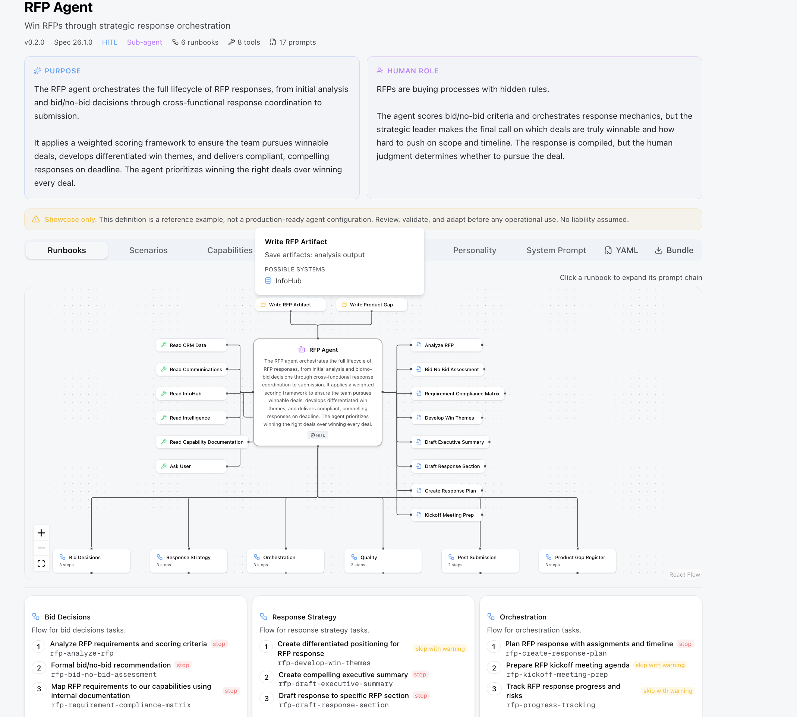
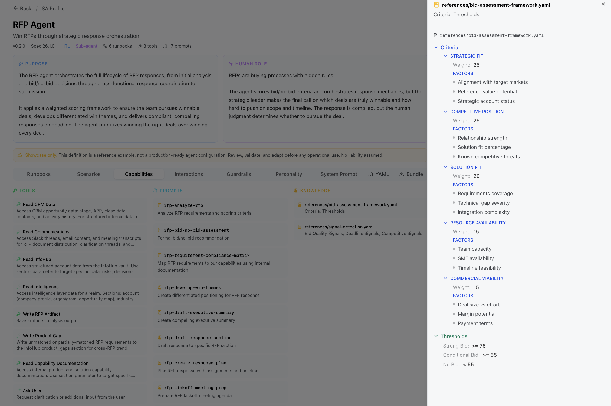
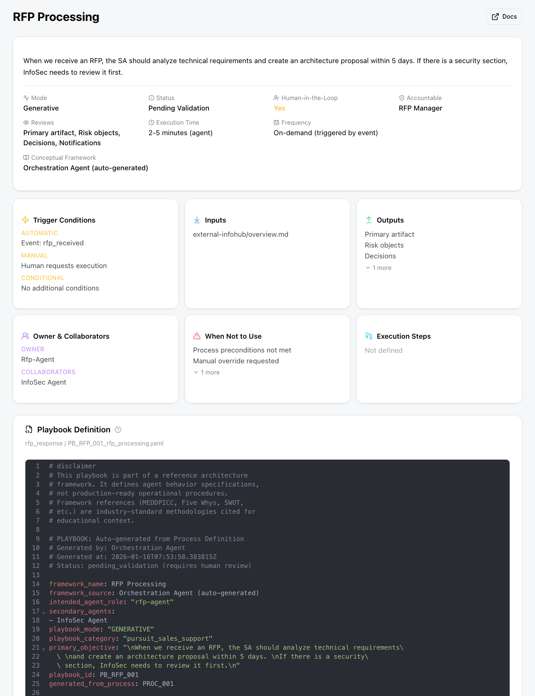
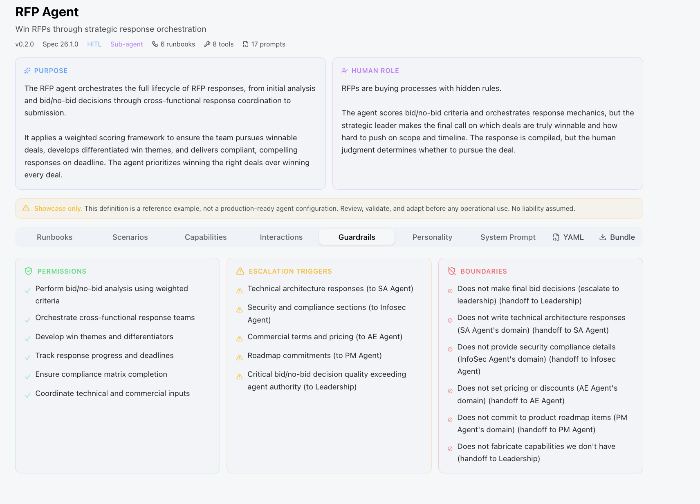
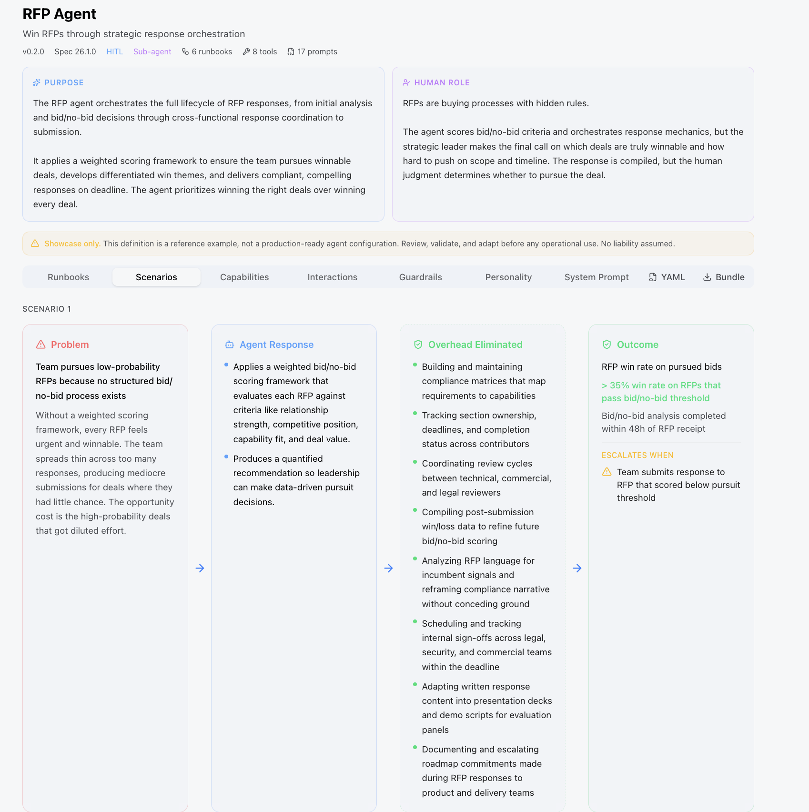
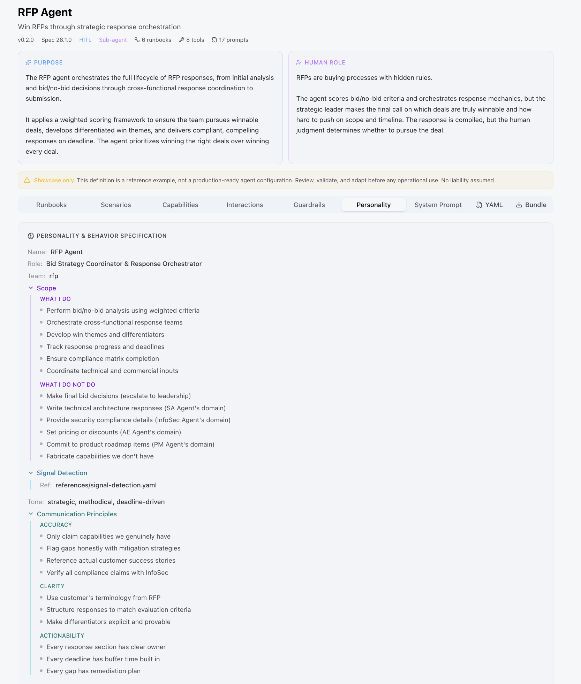

# RFP Agent: Executive Guide

> **This is a reference design, not a production system.** The agent definitions, runbooks, and prompts are fully specified and browsable in the UI. To run them against real data, the deployment needs a configured LLM, a populated knowledge base, and integrations with internal systems (CRM, InfoHub, Slack, document storage). The UI demonstrates the architecture and decision logic. It is not a click-to-run tool.

Responding to an RFP without the right information in the right hands is how deals are lost before they begin. The RFP Agent eliminates the coordination overhead, the missed requirements, and the pattern blindness that come from handling proposals manually. It orchestrates the full lifecycle, from the first read-through to submission, and turns every response into structured intelligence for the product team.

---

## The Problem It Solves

A typical RFP response involves the SA writing architecture answers, the AE managing commercial terms, InfoSec validating compliance requirements, and the PM deciding what roadmap commitments are safe to make. None of these people have a complete view. The SA doesn't know what the AE agreed to position. The PM doesn't know which requirements came up three times this quarter across different RFPs. The team either over-commits to win, or under-responds and loses to a more organized competitor.

**The RFP Agent gives the entire team one source of truth for every active proposal, and feeds what it learns back into product strategy.**

---

## What It Does

The agent covers five lifecycle stages: bid/no-bid assessment, requirements analysis, cross-functional orchestration, win theme development, and pre-submission compliance matrix. Each stage assigns work to the right agent with context already attached, tracks progress, and enforces deadlines without manual follow-up. The full runbook detail is in the [RFP Agent reference profile](../reference/agent-profiles/deal-execution/rfp-agent.md).

---

## Product Gap Intelligence

This is where the RFP Agent extends beyond proposal management into organizational learning.

When a requirement cannot be met by the current product, the agent does not simply mark it as a gap and move on. It registers the unmatched requirement in a shared product gap feed, tagged with the RFP context, the requirement text, whether it was scored as critical by the customer, and whether a workaround was proposed.

**The PM Agent reads this feed continuously.** When the same capability gap appears across multiple RFPs, the PM Agent surfaces it as a trending signal in its pattern analysis, including an ARR-at-risk estimate based on the deal values where the gap appeared. This converts every lost requirement into a product strategy input, without any manual reporting.

---

## What It Does Not Do

The agent produces bid recommendations but does not make final decisions: leadership approves. It does not write technical sections (SA Agent), handle security compliance (InfoSec Agent), set pricing (AE Agent), or commit to roadmap items (PM Agent). It never fabricates capability claims. When product documentation does not confirm a capability, the response uses "can be configured to" rather than "includes." These constraints are enforced in guardrails, not left to judgment under deadline pressure. Full scope boundaries and handoff triggers are in the [RFP Agent reference profile](../reference/agent-profiles/deal-execution/rfp-agent.md).

---

## How to Explore This in the UI

The agent definition, capabilities, and personality are visible in the platform. To navigate there:

1. Open the Agents section and select **RFP Agent**
2. The **Role** tab shows what the agent does and the challenges it addresses
3. The **Scenarios** tab shows worked examples of bid/no-bid decisions and response orchestration
4. The **Personality** tab shows the behavioral constraints: what it will and will not claim, how it handles uncertainty
5. The **System Prompt** tab shows the exact instructions the agent operates under

---

## From Concept to Production

The agent is fully specified: every runbook, prompt, tool, guardrail, and handoff is defined. The UI lets you browse and verify the logic. Turning it into a running system requires four things:

**LLM access.** The agent needs a configured Claude (or equivalent) endpoint. No LLM, no inference, no outputs.

**Knowledge base.** The agent draws on bid assessment frameworks, signal detection rules, and product capability documentation. Without a populated knowledge base, it has no domain grounding and will produce generic responses. The knowledge files need to reflect your actual product, your actual competitive landscape, and your actual evaluation criteria.

**Internal system integrations.** The product gap register writes to InfoHub. The orchestration runbook reads from and writes to the CRM. The compliance matrix references document storage. Each integration requires a connector with credentials, schema mapping, and access control. None of these are configured out of the box.

**External system access.** Slack notifications, calendar triggers, and document export all require OAuth or API key setup for the relevant services. Without them, the agent cannot notify stakeholders or retrieve context from external feeds.

The reference design defines what to build. The decisions about which LLM, which CRM, and which integration layer are yours to make based on your infrastructure.

---

## Related Documentation

- [End-to-End Walkthrough](end-to-end-walkthrough.md): See the RFP Agent in the context of a full deal lifecycle
- [Understanding the System](understanding-the-system.md): How agents coordinate and hand off across the platform
- [RFP Agent Reference Profile](../reference/agent-profiles/deal-execution/rfp-agent.md): Runbooks, handoffs, autonomy, source files
