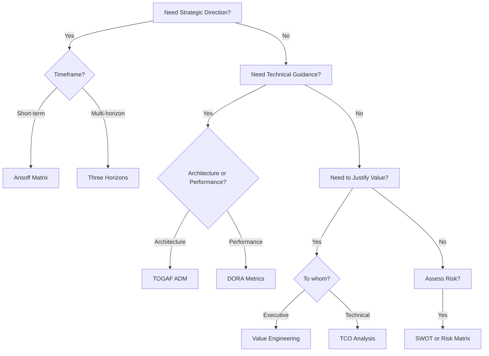

# Consulting Frameworks Catalog - Mapped to EA Agents

**Purpose:** Comprehensive catalog of proven frameworks from top consulting firms, operationalized as agent playbooks

---

## Framework Sources

### Top Consulting Firms
- **McKinsey & Company** - Strategy, operations, transformation
- **BCG (Boston Consulting Group)** - Growth, innovation, competitive strategy
- **Bain & Company** - Customer strategy, performance improvement
- **Deloitte** - Enterprise architecture, digital transformation
- **Accenture** - Technology adoption, change management

### Academic & Industry Standards
- **Michael Porter** (Harvard) - Competitive strategy
- **Geoffrey Moore** - Technology adoption
- **The Open Group** - TOGAF architecture framework
- **ISO/NIST** - Risk management standards
- **SAFE International** - Value engineering

---

## Framework Catalog by Agent

### 1. AE Agent (Account Executive) Frameworks

#### Strategic Growth & Planning

| ID | Framework | Source | When to Use | Output |
|----|-----------|--------|-------------|--------|
| **PB_001** | **Three Horizons of Growth** | McKinsey | Account planning, QBRs | Revenue roadmap across H1/H2/H3 |
| **PB_002** | **Ansoff Growth Matrix** | Igor Ansoff | Growth strategy selection | Market penetration vs. diversification |
| **PB_003** | **BCG Growth-Share Matrix** | BCG | Product portfolio analysis | Stars, Cash Cows, Question Marks, Dogs |
| **PB_004** | **GE-McKinsey Nine-Box Matrix** | GE/McKinsey | Multi-factor portfolio | Industry attractiveness vs. competitive strength |
| **PB_005** | **Blue Ocean Strategy** | INSEAD | Differentiation strategy | Value innovation canvas |

#### Value & Pricing

| ID | Framework | Source | When to Use | Output |
|----|-----------|--------|-------------|--------|
| **PB_301** | **Value Pyramid** | Bain | Value proposition design | Functional, emotional, life-changing value |
| **PB_302** | **Economic Value to Customer (EVC)** | McKinsey | Pricing strategy | Price vs. value differentiation |
| **PB_303** | **Value Engineering** | SAVE International | Business case development | ROI, NPV, payback analysis |
| **PB_304** | **Total Cost of Ownership (TCO)** | Gartner | Cost comparison | TCO vs. competitor solutions |

#### Customer Relationship

| ID | Framework | Source | When to Use | Output |
|----|-----------|--------|-------------|--------|
| **PB_401** | **Customer Lifetime Value (CLV)** | Harvard Business School | Retention strategy | CLV calculation + segment strategy |
| **PB_402** | **Net Promoter System** | Bain | Loyalty measurement | NPS score + action plan |
| **PB_403** | **Customer Journey Mapping** | Adaptive Path | CX optimization | Journey stages + pain points |
| **PB_404** | **Account-Based Marketing (ABM)** | ITSMA | Strategic account targeting | Personalization playbook |

---

### 2. SA Agent (Solution Architect) Frameworks

#### Architecture & Design

| ID | Framework | Source | When to Use | Output |
|----|-----------|--------|-------------|--------|
| **PB_101** | **TOGAF ADM** | The Open Group | Enterprise architecture | Architecture Decision Records |
| **PB_102** | **12-Factor App** | Heroku | Cloud-native assessment | Deployment readiness checklist |
| **PB_103** | **C4 Model** | Simon Brown | Architecture documentation | Context, Container, Component, Code diagrams |
| **PB_104** | **Zachman Framework** | John Zachman | EA planning | 6x6 architecture matrix |
| **PB_105** | **Microservices Patterns** | Chris Richardson | Service design | Pattern recommendations |

#### Technology Strategy

| ID | Framework | Source | When to Use | Output |
|----|-----------|--------|-------------|--------|
| **PB_111** | **Technology Adoption Lifecycle** | Geoffrey Moore | Solution maturity | Innovators → Laggards positioning |
| **PB_112** | **Gartner Hype Cycle** | Gartner | Tech trend analysis | Maturity assessment + timing |
| **PB_113** | **Wardley Mapping** | Simon Wardley | Value chain evolution | Strategic positioning map |
| **PB_114** | **Technology Radar** | ThoughtWorks | Tech stack assessment | Adopt, Trial, Assess, Hold |

#### Performance & Optimization

| ID | Framework | Source | When to Use | Output |
|----|-----------|--------|-------------|--------|
| **PB_121** | **Site Reliability Engineering (SRE)** | Google | Reliability engineering | SLO, SLI, error budget |
| **PB_122** | **DORA Metrics** | DevOps Research | DevOps maturity | Lead time, deployment freq, MTTR, change fail% |
| **PB_123** | **FinOps Framework** | FinOps Foundation | Cloud cost optimization | Cost allocation + optimization |

---

### 3. PM Agent (Product Manager) Frameworks

#### Product Strategy

| ID | Framework | Source | When to Use | Output |
|----|-----------|--------|-------------|--------|
| **PB_501** | **Product-Market Fit** | Sean Ellis | PMF assessment | PMF score + gap analysis |
| **PB_502** | **Jobs-to-be-Done (JTBD)** | Clayton Christensen | Feature prioritization | Customer jobs canvas |
| **PB_503** | **Kano Model** | Noriaki Kano | Feature classification | Must-have, Performance, Delighters |
| **PB_504** | **Product Lifecycle** | Theodore Levitt | Maturity assessment | Introduction, Growth, Maturity, Decline |

#### Prioritization

| ID | Framework | Source | When to Use | Output |
|----|-----------|--------|-------------|--------|
| **PB_511** | **RICE Scoring** | Intercom | Feature prioritization | Reach, Impact, Confidence, Effort |
| **PB_512** | **MoSCoW Method** | Dai Clegg | Requirement prioritization | Must, Should, Could, Won't |
| **PB_513** | **Value vs. Effort Matrix** | Agile | Backlog prioritization | Quick wins, Major projects, Fill-ins, Time sinks |

---

### 4. Specialist Agent Frameworks

#### Security & Compliance

| ID | Framework | Source | When to Use | Output |
|----|-----------|--------|-------------|--------|
| **PB_601** | **NIST Cybersecurity Framework** | NIST | Security assessment | Identify, Protect, Detect, Respond, Recover |
| **PB_602** | **Zero Trust Architecture** | NIST | Security model design | ZTA principles + implementation |
| **PB_603** | **STRIDE Threat Modeling** | Microsoft | Security threat analysis | Spoofing, Tampering, Repudiation, etc. |

#### Observability

| ID | Framework | Source | When to Use | Output |
|----|-----------|--------|-------------|--------|
| **PB_611** | **Three Pillars of Observability** | Honeycomb | Observability strategy | Metrics, Logs, Traces |
| **PB_612** | **USE Method** | Brendan Gregg | Performance analysis | Utilization, Saturation, Errors |
| **PB_613** | **RED Method** | Tom Wilkie | Service monitoring | Rate, Errors, Duration |

---

### 5. CI Agent (Competitive Intelligence) Frameworks

#### Competitive Analysis

| ID | Framework | Source | When to Use | Output |
|----|-----------|--------|-------------|--------|
| **PB_701** | **Porter's Five Forces** | Michael Porter | Industry analysis | Competitive dynamics assessment |
| **PB_702** | **Competitive Positioning Map** | Strategy | Market positioning | 2x2 positioning matrix |
| **PB_703** | **Win/Loss Analysis** | Sales methodology | Deal retrospective | Win factors + loss reasons |
| **PB_704** | **Battlecard Framework** | Product Marketing | Competitive response | Head-to-head comparison |
| **PB_705** | **Market Share Analysis** | BCG | Market dominance | Relative market position |

---

### 6. Delivery Agent Frameworks

#### Project Management

| ID | Framework | Source | When to Use | Output |
|----|-----------|--------|-------------|--------|
| **PB_801** | **Critical Path Method (CPM)** | DuPont/Remington Rand | Project scheduling | Critical path + float analysis |
| **PB_802** | **Earned Value Management (EVM)** | PMI | Project performance | CPI, SPI, forecasting |
| **PB_803** | **Agile Maturity Model** | Agile Alliance | Team assessment | Maturity stage + recommendations |

#### Change Management

| ID | Framework | Source | When to Use | Output |
|----|-----------|--------|-------------|--------|
| **PB_811** | **ADKAR Model** | Prosci | Change management | Awareness, Desire, Knowledge, Ability, Reinforcement |
| **PB_812** | **Kotter's 8-Step Process** | John Kotter | Transformation | 8-step change roadmap |
| **PB_813** | **McKinsey 7S Framework** | McKinsey | Organizational alignment | Strategy, Structure, Systems, etc. |

---

### 7. Partner Agent Frameworks

#### Partnership Strategy

| ID | Framework | Source | When to Use | Output |
|----|-----------|--------|-------------|--------|
| **PB_901** | **Partner Ecosystem Map** | Accenture | Partnership landscape | Partner categories + roles |
| **PB_902** | **Alliance Maturity Model** | Vantage Partners | Partnership health | Maturity assessment + roadmap |
| **PB_903** | **Co-opetition Framework** | Brandenburger/Nalebuff | Competitive cooperation | Value net analysis |

---

### 8. CA Agent (Customer Architect) Frameworks

#### Solution Adoption

| ID | Framework | Source | When to Use | Output |
|----|-----------|--------|-------------|--------|
| **PB_1001** | **Technology Adoption Model (TAM)** | Davis/Venkatesh | Adoption prediction | Perceived usefulness + ease of use |
| **PB_1002** | **Capability Maturity Model (CMM)** | SEI/Carnegie Mellon | Process maturity | Level 1-5 assessment |
| **PB_1003** | **Customer Health Score** | Gainsight | Retention risk | Composite health metric |

---

### 9. Customer Success Playbooks (CA/AE/SA Agents)

Customer success playbooks adapted from industry best practices for customer engagement, health management, and value realization.

See: [Customer Success Playbooks](../guides/for-practitioners/customer-success-playbooks.md) for full documentation.

#### Stage Adoption

| ID | Framework | Source | When to Use | Output |
|----|-----------|--------|-------------|--------|
| **PB_CS_101** | **Security Stage Adoption** | Industry CS Best Practices | New security customer | Adoption journey + enablement plan |
| **PB_CS_102** | **Observability Stage Adoption** | Industry CS Best Practices | New observability customer | Adoption journey + enablement plan |
| **PB_CS_103** | **Search Stage Adoption** | Industry CS Best Practices | New search customer | Adoption journey + enablement plan |

#### Engagement Cadence

| ID | Framework | Source | When to Use | Output |
|----|-----------|--------|-------------|--------|
| **PB_CS_201** | **Discovery Engagement** | Industry CS Best Practices | Initial customer discovery | Discovery findings + success criteria |
| **PB_CS_202** | **Cadence Calls** | Industry CS Best Practices | Ongoing engagement | Meeting notes + action items |
| **PB_CS_203** | **Executive Business Review** | Industry CS Best Practices | Quarterly executive touch | EBR presentation + value story |

#### Health Management

| ID | Framework | Source | When to Use | Output |
|----|-----------|--------|-------------|--------|
| **PB_CS_301** | **Health Triage** | Industry CS Best Practices | Health score decline | Triage report + intervention plan |
| **PB_CS_302** | **Risk Intervention** | Industry CS Best Practices | Specific risk triggered | Risk mitigation actions |
| **PB_CS_303** | **Renewal Protection** | Industry CS Best Practices | T-180 to renewal | Renewal plan + value documentation |

#### Technical Enablement

| ID | Framework | Source | When to Use | Output |
|----|-----------|--------|-------------|--------|
| **PB_CS_401** | **Technical Workshop** | Industry CS Best Practices | Enablement needed | Training delivered + proficiency |
| **PB_CS_402** | **Migration Playbook** | Industry CS Best Practices | Competitive displacement | Migration plan + execution |
| **PB_CS_403** | **POV Execution** | Industry CS Best Practices | Technical evaluation | POV results + success criteria |

#### Lifecycle Transitions

| ID | Framework | Source | When to Use | Output |
|----|-----------|--------|-------------|--------|
| **PB_CS_501** | **Pre-to-Post Handoff** | Industry CS Best Practices | Deal closed | Context transfer + relationship continuity |
| **PB_CS_502** | **Expansion Planning** | Industry CS Best Practices | Expansion opportunity | Expansion proposal + business case |

#### Analysis Frameworks (Integrated)

| ID | Framework | Source | When to Use | Output |
|----|-----------|--------|-------------|--------|
| **PB_105** | **Five Whys Analysis** | Toyota Production System | Root cause needed | Root cause + countermeasures |
| **PB_601** | **Retrospective** | Agile + Five Whys | Deal won/lost | Learnings + process improvements |
| **PB_602** | **Account Planning** | Enterprise Sales + Five Whys | Annual planning | Account plan + blockers resolved |

---

## Cross-Functional Frameworks (All Agents)

### Strategic Analysis

| ID | Framework | Source | When to Use | Output |
|----|-----------|--------|-------------|--------|
| **PB_201** | **SWOT Analysis** | Albert Humphrey | Strategic assessment | Strengths, Weaknesses, Opportunities, Threats |
| **PB_202** | **PESTEL Analysis** | Harvard | Macro environment | Political, Economic, Social, Technological, Environmental, Legal |
| **PB_203** | **Scenario Planning** | Shell | Future visioning | Multiple future scenarios |
| **PB_204** | **Business Model Canvas** | Strategyzer | Business model design | 9-block canvas |

### Risk Management

| ID | Framework | Source | When to Use | Output |
|----|-----------|--------|-------------|--------|
| **PB_211** | **Risk Matrix (5x5)** | ISO 31000 | Risk assessment | Severity x Likelihood grid |
| **PB_212** | **FMEA** | Automotive industry | Failure analysis | Risk Priority Number |
| **PB_213** | **Pre-Mortem Analysis** | Gary Klein | Project risk planning | Failure scenarios + preventions |
| **PB_214** | **Bow-Tie Analysis** | Shell | Risk visualization | Threats → Event → Consequences |

### Decision Making

| ID | Framework | Source | When to Use | Output |
|----|-----------|--------|-------------|--------|
| **PB_221** | **Decision Matrix** | Decision science | Multi-criteria decisions | Weighted scoring |
| **PB_222** | **Six Thinking Hats** | Edward de Bono | Group decision-making | Parallel thinking perspectives |
| **PB_223** | **Cynefin Framework** | Dave Snowden | Problem classification | Simple, Complicated, Complex, Chaotic |

---

## Framework Implementation Priority

### Phase 1: Core Playbooks (Immediate)
1. **PB_001** - Three Horizons (strategic planning baseline)
2. **PB_201** - SWOT (risk and strategic context)
3. **PB_301** - Value Engineering (business case standard)
4. **PB_101** - TOGAF ADM (architecture decisions)
5. **PB_701** - Porter's Five Forces (competitive analysis)

### Phase 2: Expansion (Month 2)
6. **PB_401** - Customer Health Score
7. **PB_002** - Ansoff Matrix
8. **PB_111** - Technology Adoption Lifecycle
9. **PB_211** - Risk Matrix
10. **PB_703** - Win/Loss Analysis

### Phase 3: Specialist Playbooks (Month 3)
11-30: Domain-specific frameworks per agent

---

## Playbook Metadata Standard

Every playbook includes:

```yaml
# Metadata
playbook_id: "PB_XXX"
name: "Framework Name"
framework_source: "Consulting Firm / Author"
source_url: "Link to original framework"
category: "strategic | technical | risk | value | competitive"
complexity: "simple | moderate | advanced"
estimated_time: "X minutes"

# Application
applicable_agents: ["ae_agent", "sa_agent"]
trigger_conditions: []
inputs_required: []
outputs_generated: []

# Framework Details
framework_description: |
  Brief explanation of the framework

key_concepts:
  - concept_1
  - concept_2

decision_criteria:
  - condition: "X"
    recommendation: "Y"

# Execution
procedure:
  steps: []

templates:
  output: "path/to/template.md"

# Success
success_metrics: []
validation_checks: []
```

---

## Benefits by Framework Type

### Strategic Frameworks (McKinsey, BCG, Bain)
- **Credibility:** Instant recognition with executives
- **Rigor:** Proven methodologies, not custom approaches
- **Communication:** Common language with C-suite

### Technical Frameworks (TOGAF, 12-Factor, SRE)
- **Best Practices:** Industry-standard patterns
- **Validation:** Checkable compliance
- **Documentation:** Standardized artifacts

### Value Frameworks (Value Engineering, ROI)
- **Quantification:** Financial justification
- **Prioritization:** Data-driven decisions
- **Stakeholder Buy-In:** CFO-friendly analysis

---

## Framework Selection Guide

### When to Use Which Framework?



---

## Next Steps

1. **Implement playbook engine** (`core/playbook_engine.py`)
2. **Create 5 Phase 1 playbooks** (full YAML + templates)
3. **Test on real account data**
4. **Measure execution time & quality**
5. **Expand library based on usage patterns**

---

**Total Frameworks Cataloged:** 75+
**Immediate Implementation Target:** 10
**Customer Success Playbooks:** 15 (3 implemented)
**Full Library Goal:** 60+ playbooks

**Status:** Catalog complete, customer success playbooks in active development
